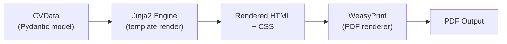

# PDF Rendering Library Selection

**Version**: 1.0
**Created**: 2026-05-12
**Author**: Orlando Bruno
**Status**: Implemented
**Area**: eng (Rendering engine)
**Related Documents**: `ADR-002__tpl__template-format.md`, `_Design/01_Requirements/`, `pyproject.toml`

---

## Executive Summary

Paperwork requires a PDF rendering pipeline that can convert HTML+CSS CV templates into high-quality documents. After evaluating four candidates — WeasyPrint, Puppeteer/Chrome headless, LaTeX/pdflatex, and ReportLab — WeasyPrint was selected as the rendering library. It is Python-native, integrates cleanly with the engine via a pure Python API, supports HTML+CSS templates (making templates approachable to any web developer), and handles CSS paged media natively. The system library footprint (Pango, Cairo, GLib) is acceptable given the project's Docker-first deployment model.

---

## 1. Problem Statement

### Context

Paperwork must convert structured CV data into a polished PDF document. The rendering approach is foundational: it determines what template authoring language is used, what system dependencies must be present, how the tool deploys in Docker, and whether the output quality is acceptable for a professional resume. This decision was made during initial architecture design before any rendering code was written.

### Desired Outcome

Select a PDF rendering library that:
- Produces professional-quality output suitable for a CV
- Allows templates to be authored by web developers (HTML+CSS), not just typesetting specialists
- Integrates with a Python codebase without requiring a Node.js or LaTeX runtime
- Is deployable in a Linux Docker container with manageable image size
- Exposes a clean Python API with no subprocess wrapping

---

## 2. Architecture Overview



WeasyPrint sits at the final stage of the rendering pipeline. It receives fully rendered HTML and associated CSS stylesheets, then writes a PDF to disk. All upstream steps (template rendering, data injection) are independent of this choice.

---

## 3. Options Considered

### Option A: WeasyPrint

**Description**: Python-native headless browser that renders HTML+CSS to PDF using Pango (text layout), Cairo (vector graphics), and GLib. Installed via pip; system dependencies installed via Homebrew (macOS) or apt (Linux). Supports CSS paged media specification.

**Pros**:
- Pure Python API — no subprocess, no Node.js dependency
- CSS paged media support (`@page`, `size`, `margin`, `page-break`) enables proper multi-page CV layouts
- Templates are plain HTML+CSS — any web developer can author or modify them
- Docker-friendly — system libs are well-packaged on Debian/Ubuntu
- Active maintenance (v66+), good documentation

**Cons**:
- CSS support lags behind Chromium — some modern CSS features are not implemented
- System library dependency (Pango, Cairo, GLib) adds complexity on macOS without Homebrew
- Rendering behaviour may differ subtly between macOS and Linux due to library version deltas

---

### Option B: Puppeteer / Chrome Headless

**Description**: Chromium-based rendering invoked via subprocess or Playwright. Industry-standard CSS rendering fidelity — what you see in Chrome is what you get in the PDF.

**Pros**:
- Highest possible CSS fidelity — full modern CSS support
- Familiar to frontend developers
- Reliable page break and layout handling

**Cons**:
- Requires a full Chromium binary (~300 MB) — significantly inflates Docker image size
- Introduces a Node.js dependency into a Python project, or requires Playwright's browser download step
- Subprocess-based invocation is fragile; headless Chrome flags differ across OS versions
- Licensing and update complexity in a containerised environment

---

### Option C: LaTeX / pdflatex

**Description**: Traditional professional typesetting system. Templates are `.tex` files compiled by pdflatex or XeLaTeX. The gold standard for academic and technical document quality.

**Pros**:
- Outstanding typographic quality — professional-grade kerning, hyphenation, ligatures
- Extremely precise layout control
- Universally accepted in academic contexts

**Cons**:
- Requires a full LaTeX distribution (TeX Live, ~1–4 GB) — impractical for a CLI tool
- Templates must be written in LaTeX, not HTML/CSS — dramatically narrows the pool of template authors
- Conflicts with the HTML+CSS template authoring goal
- Steep learning curve for users wanting to customise templates

---

### Option D: ReportLab

**Description**: Pure Python library for programmatic PDF generation. Layouts are defined in Python code rather than HTML/CSS.

**Pros**:
- Pure Python — zero system dependencies
- Fine-grained control over every PDF primitive

**Cons**:
- No HTML/CSS input — templates must be written as Python layout code
- Poor separation of content and presentation — layout logic mixed with rendering engine
- Extremely verbose for anything beyond simple documents
- Not suitable for a template-based system where templates are meant to be swappable

---

## 4. Chosen Solution

**Decision**: Option A — WeasyPrint

**Rationale**: WeasyPrint is the only option that satisfies all three primary constraints simultaneously: Python-native API, HTML+CSS template authoring, and manageable deployment footprint. The CSS fidelity gap versus Chromium is real but acceptable — CVs are layout-conservative documents; they do not require cutting-edge CSS features. The system library footprint is mitigated by the Docker-first deployment model where libs are pre-installed in the image. Template authors can use standard HTML and CSS with CSS paged media extensions, which is a well-documented and stable subset.

---

## 5. Implementation Specification

### Components

| Component | Responsibility | Technology |
|---|---|---|
| `src/paperwork/engine/renderer.py` | Convert rendered HTML to PDF via WeasyPrint | `weasyprint.HTML`, `weasyprint.CSS` |
| `pyproject.toml` | Declare WeasyPrint as a runtime dependency | `weasyprint>=66.0` |
| `src/paperwork/cli/app.py` | Detect and configure Homebrew lib path on macOS at startup | `DYLD_FALLBACK_LIBRARY_PATH` env var |
| `Dockerfile` | Pre-install system libraries for Linux rendering | `libpango-1.0-0`, `libcairo2`, `libgdk-pixbuf-2.0-0` |

### Key Interfaces

```python
from weasyprint import HTML, CSS

def render_pdf(html_content: str, stylesheets: list[CSS], base_url: str, output_path: Path) -> None:
    document = HTML(string=html_content, base_url=base_url)
    document.write_pdf(output_path, stylesheets=stylesheets)
```

CSS override support (used by auto-fit feature):

```python
override_css = CSS(string="body { font-size: 10.5pt; }")
render_pdf(html, base_stylesheets + [override_css], base_url, output_path)
```

macOS library path configuration (CLI startup):

```python
import os
homebrew_lib = "/opt/homebrew/lib"  # Apple Silicon default
if Path(homebrew_lib).exists():
    os.environ.setdefault("DYLD_FALLBACK_LIBRARY_PATH", homebrew_lib)
```

---

## 6. Performance & Cost

| Metric | Expected | Target |
|---|---|---|
| Single-page PDF render time (M-series Mac) | 3–6 s | < 10 s |
| Single-page PDF render time (Linux Docker) | 4–8 s | < 10 s |
| Docker image size delta (system libs) | ~60 MB | < 100 MB |
| WeasyPrint pip install size | ~10 MB | — |
| Memory usage per render | ~80–150 MB | < 512 MB |

---

## 7. Quality Assurance & Validation

### Success Metrics

- [ ] Single-page CV renders to PDF in under 10 seconds on an M-series Mac
- [ ] PDF is visually faithful to the HTML preview across all bundled templates
- [ ] Render succeeds on Linux (Docker) with no system library errors
- [ ] CSS `@page` size and margins are respected in the output PDF
- [ ] CSS override injection (auto-fit) applies correctly and measurably

### Testing Strategy

- **Unit tests**: Test `renderer.py` in isolation with a minimal HTML fixture; assert PDF is written to the expected path and is non-empty
- **Integration tests**: Render each bundled template with a standard CVData fixture; assert page count and approximate file size are within expected bounds
- **Visual regression**: Snapshot PDFs at known checkpoints; flag unexpected layout changes during WeasyPrint version upgrades

---

## 8. Risks & Mitigation

| Risk | Impact | Likelihood | Mitigation |
|---|---|---|---|
| WeasyPrint CSS gap causes template rendering failures | High | Medium | Restrict templates to WeasyPrint-supported CSS; document unsupported properties in template authoring guide |
| System lib version delta between macOS and Linux produces rendering differences | Medium | Medium | CI runs on Linux Docker; visual regression tests catch cross-platform divergence |
| WeasyPrint major version upgrade breaks existing templates | High | Low | Pin `weasyprint>=66.0,<67.0` in pyproject.toml; run full template render suite before upgrading |
| Homebrew path detection fails on non-standard macOS installs | Low | Low | Fallback: document manual `DYLD_FALLBACK_LIBRARY_PATH` configuration in README |

---

## 9. Implementation Roadmap

### Phase 1: Core Renderer

- [x] Add `weasyprint>=66.0` to `pyproject.toml`
- [x] Implement `renderer.py` with `HTML.write_pdf()` call
- [x] Wire renderer into CLI `render` command
- [x] Add macOS Homebrew lib path detection at CLI startup

### Phase 2: Docker Integration

- [x] Add system lib installation to `Dockerfile` (`libpango`, `libcairo2`, `libgdk-pixbuf2.0-0`)
- [x] Verify render on Linux CI

### Phase 3: CSS Override Support

- [x] Accept additional `CSS(string=...)` objects in renderer interface
- [x] Connect to auto-fit feature for font-size adjustment

---

## 10. Decision Log

| Date | Decision | Rationale |
|---|---|---|
| 2026-05-12 | Selected WeasyPrint over Puppeteer, LaTeX, ReportLab | Only option satisfying Python-native + HTML/CSS + manageable Docker footprint simultaneously |
| 2026-05-12 | Pinned `weasyprint>=66.0` | First version with stable CSS paged media and `write_pdf()` signature used in implementation |
| 2026-05-12 | Auto-detect Homebrew lib path at CLI startup | Avoids requiring macOS users to set env vars manually |

---

## 11. Success Criteria

- [ ] All bundled templates render to PDF without errors on macOS and Linux
- [ ] Render time for a single-page CV is under 10 seconds on both platforms
- [ ] Docker image builds successfully with system libs installed
- [ ] CSS override mechanism works correctly for auto-fit font scaling
- [ ] No subprocess calls to external binaries during rendering

---

## 12. Related Documents

- `ADR-002__tpl__template-format.md` — Template format decision (HTML+CSS+Jinja2) that WeasyPrint rendering enables
- `pyproject.toml` — Runtime dependency declaration
- `Dockerfile` — System library installation for Linux rendering
- `src/paperwork/engine/renderer.py` — Primary implementation site
- `src/paperwork/cli/app.py` — macOS library path detection

---

**Last Updated**: 2026-05-12 by Orlando Bruno
