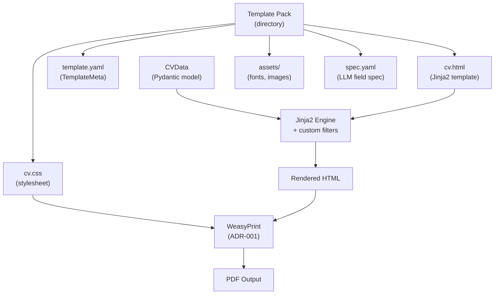

# CV Template Format — HTML + CSS + Jinja2

**Version**: 1.0
**Created**: 2026-05-12
**Author**: Orlando Bruno
**Status**: Implemented
**Area**: tpl (Template system)
**Related Documents**: `ADR-001__eng__pdf-rendering-library.md`, `src/paperwork/engine/filters.py`, `src/paperwork/templates/`

---

## Executive Summary

Paperwork needs a template format that separates CV content from visual presentation, is approachable to web developers without requiring engine knowledge, supports rich layouts (columns, grids, typography), and is extensible without engine changes. After evaluating four approaches — HTML+CSS+Jinja2, LaTeX templates, Markdown templates, and a proprietary DSL — HTML+CSS+Jinja2 was selected. Template packs are directories containing a Jinja2 HTML file, a CSS stylesheet, and a `template.yaml` manifest. The engine injects `CVData` as the Jinja2 context, produces HTML, and passes it to WeasyPrint. Any web developer can author or modify templates; adding a new template requires zero engine code changes.

---

## 1. Problem Statement

### Context

Paperwork's value proposition is its ability to render any structured CV into a polished, design-consistent PDF. Templates are the primary extensibility surface — the engine must support a template format that allows the community to contribute designs independently of the core codebase. The format must also be the natural output target for the WeasyPrint rendering pipeline chosen in ADR-001.

### Desired Outcome

Select a template format that:
- Cleanly separates CV content (Pydantic model) from visual presentation (template files)
- Is authorable by any web developer without deep knowledge of the Paperwork engine internals
- Supports complex layouts: multi-column sections, photo placement, grid-based designs, custom typography
- Integrates naturally with the WeasyPrint rendering pipeline (HTML+CSS input)
- Allows new templates to be added without modifying engine source code
- Is machine-readable enough to support LLM-assisted profile generation via a companion spec

---

## 2. Architecture Overview



The template pack is a self-contained directory. The engine reads the manifest to discover the HTML and CSS entry points, constructs a Jinja2 `Environment` pointed at the template directory, renders the HTML with `CVData` as context, then passes the result directly to WeasyPrint.

---

## 3. Options Considered

### Option A: HTML + CSS + Jinja2

**Description**: Templates are directories containing a Jinja2 HTML file, a CSS stylesheet, an optional `assets/` directory (fonts, images), and a `template.yaml` manifest. The engine renders the Jinja2 template with the `CVData` Pydantic model as context, then passes the resulting HTML to WeasyPrint.

**Pros**:
- Largest pool of potential template authors — any web developer can contribute
- Maximum layout flexibility via CSS Grid, Flexbox, and CSS paged media
- Natural pipeline fit with WeasyPrint (HTML+CSS is its native input format)
- Jinja2 is widely known in the Python ecosystem — low learning curve for filters and template logic
- Zero engine code changes required to add a new template
- Machine-readable manifest (`template.yaml`) supports tooling and LLM-assisted generation

**Cons**:
- WeasyPrint's limited CSS subset means some modern CSS features will not render correctly
- Template authors must understand Jinja2 scoping rules (e.g., `namespace()` for mutable loop state)
- No hot-reload during template development — must re-run `paperwork preview` after each change

---

### Option B: LaTeX Templates

**Description**: Templates are `.tex` files with LaTeX macros. A LaTeX compiler (pdflatex, XeLaTeX) generates PDF directly.

**Pros**:
- Outstanding typographic quality — the established standard for academic and technical documents
- Extremely precise control over every layout detail

**Cons**:
- Requires a full LaTeX distribution (TeX Live, ~1–4 GB) — impractical alongside a lightweight CLI
- Conflicts directly with the WeasyPrint rendering decision (ADR-001)
- LaTeX expertise is rare compared to HTML/CSS knowledge — severely narrows the contributor pool
- Template debugging is difficult; LaTeX error messages are notoriously opaque

---

### Option C: Markdown Templates

**Description**: Templates are Markdown files with YAML frontmatter. A Markdown-to-PDF converter generates output.

**Pros**:
- Extremely simple to write and read
- No language expertise required beyond basic Markdown

**Cons**:
- Insufficient layout capability for professional CV designs — Markdown has no concept of columns, grids, photo placement, or fine-grained typography
- Most Markdown-to-PDF converters (pandoc + LaTeX, wkhtmltopdf) introduce the same dependency problems as Options B or D
- Severely limits design differentiation between templates

---

### Option D: Proprietary DSL

**Description**: Define a custom template language purpose-built for CV layout — a domain-specific language with CV-aware primitives (section, entry, sidebar, photo).

**Pros**:
- Maximum semantic control over CV-specific constructs
- Could enforce structural consistency across all templates

**Cons**:
- Massive authoring burden — template authors must learn a non-standard, underdocumented language
- Locks the project into maintaining a custom parser and renderer in perpetuity
- Zero community familiarity; no existing tooling (syntax highlighting, linting, formatters)
- Provides no benefit over Jinja2+HTML for the actual use cases in scope

---

## 4. Chosen Solution

**Decision**: Option A — HTML + CSS + Jinja2

**Rationale**: HTML+CSS+Jinja2 is the only option that satisfies all primary constraints: the widest possible author pool (web developers), maximum layout flexibility, natural fit with the WeasyPrint rendering pipeline, and zero engine changes required to add new templates. The WeasyPrint CSS compatibility constraint is real but manageable — CVs are layout-conservative documents, and the relevant CSS features (Flexbox, Grid, custom properties, paged media) are well-supported by WeasyPrint. Jinja2 is a mature, well-documented templating engine already widely used in the Python ecosystem, minimising the learning curve for template authors.

---

## 5. Implementation Specification

### Components

| Component | Responsibility | Technology |
|---|---|---|
| `template.yaml` (per template) | Declares metadata, entry points, field requirements, layout params | YAML, `TemplateMeta` Pydantic model |
| `cv.html` (per template) | Jinja2 HTML template — CV layout and content structure | Jinja2, HTML, CSS paged media |
| `cv.css` (per template) | Visual styling — typography, colours, spacing, layout | CSS (WeasyPrint-compatible subset) |
| `assets/` (per template, optional) | Fonts, icons, images referenced by the template | Binary / web font files |
| `spec.yaml` (per template, optional) | Machine-readable field specification for LLM-assisted profile generation | YAML |
| `src/paperwork/engine/filters.py` | Custom Jinja2 filters registered on the Environment (date formatting, string utilities) | Python |
| `src/paperwork/engine/renderer.py` | Constructs `jinja2.Environment`, renders template, passes HTML to WeasyPrint | Python, Jinja2 |

### Template Pack Structure

```
templates/
  my-template/
    template.yaml       # TemplateMeta manifest (required)
    cv.html             # Jinja2 HTML entry point (required)
    cv.css              # Primary stylesheet (required)
    cv.scss             # SCSS source (optional — compiled separately)
    spec.yaml           # LLM field spec (optional)
    assets/
      fonts/
      icons/
```

### Key Interfaces

`template.yaml` — TemplateMeta schema:

```yaml
name: "Classic"
slug: "classic"
version: "1.0.0"
html_file: "cv.html"
css_file: "cv.css"
scss_file: "cv.scss"          # optional
spec_file: "spec.yaml"         # optional
supports_photo: true
required_fields:
  - personal_info.name
  - personal_info.email
optional_fields:
  - personal_info.phone
  - personal_info.website
layout_params:
  columns: 1
  sidebar: false
```

Jinja2 Environment construction:

```python
from jinja2 import Environment, FileSystemLoader
from paperwork.engine import filters as custom_filters

def build_environment(template_dir: Path) -> Environment:
    env = Environment(
        loader=FileSystemLoader(str(template_dir)),
        autoescape=False,
    )
    env.filters["format_date"] = custom_filters.format_date
    env.filters["markdown_to_html"] = custom_filters.markdown_to_html
    return env

def render_template(env: Environment, cv_data: CVData) -> str:
    template = env.get_template("cv.html")
    return template.render(cv=cv_data)
```

WeasyPrint handoff (see ADR-001 for full renderer interface):

```python
base_url = template_dir.as_uri()
html_content = render_template(env, cv_data)
render_pdf(html_content, stylesheets=[CSS(template_dir / "cv.css")], base_url=base_url, output_path=output_path)
```

`spec.yaml` — LLM field spec (example excerpt):

```yaml
fields:
  personal_info.name:
    label: "Full Name"
    type: string
    required: true
    hint: "First and last name as you want them to appear on the CV"
  experience[].role:
    label: "Job Title"
    type: string
    required: true
```

---

## 6. Performance & Cost

| Metric | Expected | Target |
|---|---|---|
| Jinja2 template render time (single page) | < 100 ms | < 500 ms |
| Template directory scan at startup | < 50 ms | < 200 ms |
| SCSS compilation (optional, external step) | 200–500 ms | Not on critical path |
| Template pack size (typical, no binary fonts) | 20–80 KB | < 500 KB |
| Template pack size (with web fonts) | 200 KB – 2 MB | < 5 MB |

---

## 7. Quality Assurance & Validation

### Success Metrics

- [ ] A new template can be added by placing a directory under `templates/` with no engine code changes
- [ ] All required `TemplateMeta` fields are validated at template load time with clear error messages
- [ ] Custom Jinja2 filters produce correct output for all supported date formats and string operations
- [ ] `base_url` set to template directory URI resolves all relative asset paths correctly in WeasyPrint
- [ ] `spec.yaml` is parseable and correctly describes all fields referenced in the corresponding `cv.html`

### Testing Strategy

- **Unit tests**: Test each custom Jinja2 filter in isolation with fixed input/output fixtures
- **Integration tests**: Render each bundled template with a standard `CVData` fixture; assert rendered HTML contains expected structural elements (section headings, personal info block, experience entries)
- **Schema validation tests**: Load each bundled `template.yaml`; validate against `TemplateMeta` Pydantic model; assert no validation errors
- **Asset resolution tests**: Render a template with a local font reference; assert WeasyPrint does not emit asset-not-found warnings

---

## 8. Risks & Mitigation

| Risk | Impact | Likelihood | Mitigation |
|---|---|---|---|
| WeasyPrint CSS gap causes template layout failures | High | Medium | Document supported CSS subset in template authoring guide; test all bundled templates on each WeasyPrint version bump |
| Jinja2 scoping errors in community templates (mutable loop state) | Medium | Medium | Document `namespace()` pattern prominently in template authoring guide; add linting step to CI for contributed templates |
| Template authors use SCSS features that break when compiled differently | Low | Low | Mark SCSS as optional and outside the engine scope; document that `cv.css` is the authoritative stylesheet |
| `spec.yaml` drift from `cv.html` (fields documented but not rendered, or vice versa) | Medium | Low | Add CI validation step that cross-checks spec field keys against Jinja2 variable references in `cv.html` |
| Large binary font assets bloat the repository | Low | Medium | Add `assets/` to `.gitattributes` for Git LFS; document font licensing requirements |

---

## 9. Implementation Roadmap

### Phase 1: Core Template Engine

- [x] Define `TemplateMeta` Pydantic model and YAML loader
- [x] Implement `build_environment()` with `FileSystemLoader` pointed at template directory
- [x] Register initial custom Jinja2 filters (`format_date`, `markdown_to_html`)
- [x] Implement `render_template()` and wire into renderer pipeline
- [x] Set `base_url` to template directory URI for asset resolution

### Phase 2: First Bundled Template

- [x] Create `templates/classic/` with `template.yaml`, `cv.html`, `cv.css`
- [x] Validate rendering with a standard `CVData` fixture
- [x] Confirm asset resolution for fonts and icons

### Phase 3: Template Manifest & Validation

- [x] Add startup validation of `TemplateMeta` for all discovered templates
- [x] Add clear error messages for missing required fields
- [x] Document `template.yaml` schema in template authoring guide

### Phase 4: LLM Spec Support

- [x] Define `spec.yaml` schema
- [x] Add `spec_file` field to `TemplateMeta`
- [ ] Implement CI cross-check: spec field keys vs Jinja2 variable references in `cv.html`

---

## 10. Decision Log

| Date | Decision | Rationale |
|---|---|---|
| 2026-05-12 | Selected HTML+CSS+Jinja2 over LaTeX, Markdown, proprietary DSL | Only format satisfying web-developer accessibility + layout flexibility + WeasyPrint pipeline fit simultaneously |
| 2026-05-12 | Used `FileSystemLoader` with template directory as root | Enables `base_url` asset resolution and keeps template file references relative and portable |
| 2026-05-12 | `autoescape=False` in Jinja2 Environment | CV data is trusted internal content; HTML escaping would corrupt inline markup in field values |
| 2026-05-12 | Added `spec_file` to `TemplateMeta` as optional | Enables LLM-assisted profile generation without making it a hard requirement for all templates |

---

## 11. Success Criteria

- [ ] All bundled templates render correctly with no Jinja2 or WeasyPrint errors
- [ ] A new template directory can be added and rendered without modifying any engine source file
- [ ] `TemplateMeta` validation catches missing required fields with actionable error messages
- [ ] All custom Jinja2 filters have passing unit tests with documented input/output contracts
- [ ] Template authoring guide documents the WeasyPrint-compatible CSS subset and Jinja2 scoping patterns

---

## 12. Related Documents

- `ADR-001__eng__pdf-rendering-library.md` — WeasyPrint selection; defines the HTML+CSS input requirement that makes this template format the natural choice
- `src/paperwork/engine/renderer.py` — Jinja2 environment construction and template rendering
- `src/paperwork/engine/filters.py` — Custom Jinja2 filter implementations
- `src/paperwork/templates/` — Bundled template packs
- `pyproject.toml` — Jinja2 runtime dependency declaration

---

**Last Updated**: 2026-05-12 by Orlando Bruno
