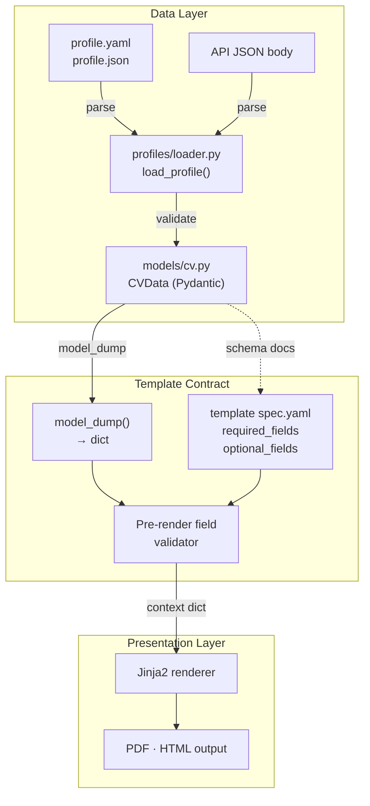

# CVData — Pydantic Model as Profile-Template Contract

**Version**: 1.0 / **Created**: 2026-05-12 / **Author**: Orlando Bruno / **Status**: Implemented / **Area**: sys / **Related Documents**: `ADR-003__sys__engine-only-design.md`, `src/paperwork/models/cv.py`, `_Design/02_Specs/`

---

## Executive Summary

Paperwork adopts a Pydantic v2 `CVData` model as the single schema that validates all incoming profile data and serves as the rendering context passed to templates. This model is the contract between the data layer and the presentation layer: profile YAML/JSON is validated against it on load, and templates receive a clean dictionary via `model_dump()`. Strong typing catches malformed profiles at load time with actionable error messages, Pydantic v2 delivers excellent validation performance, and the schema doubles as machine-readable documentation for template authors and LLM-assisted profile generation.

---

## 1. Problem Statement — Context + Desired Outcome

**Context**: Paperwork accepts user-authored profile data in YAML or JSON format and passes it to a Jinja2 template to produce a rendered CV. Without a defined schema, there is no way to validate that the incoming data is well-formed before rendering, and templates have no stable contract to target. Malformed data produces unhelpful rendering errors deep inside the template engine.

**Desired Outcome**: A strongly-typed, validated schema that (1) catches bad profile data at load time with clear error messages, (2) gives templates a stable, documented dict context, and (3) serves as a target schema for LLM-assisted profile generation via `spec.yaml`.

---

## 2. Architecture Overview



`CVData` sits at the centre of the pipeline. It is the only point at which raw user data is validated. Everything downstream receives a typed Python object or its clean dict representation.

---

## 3. Options Considered

### Option A: Pydantic Model (CVData) — Chosen

A strongly-typed Pydantic v2 `BaseModel` defines all fields with types and defaults. Profile YAML/JSON is validated on load. Templates receive a clean dict via `model_dump()`.

Pros:
- Validation errors are raised at load time with field-level messages
- Full Python type safety throughout the rendering pipeline
- `model_dump()` produces a predictable dict for templates
- Pydantic v2 validation is very fast (Rust core)
- Schema doubles as documentation for template authors and LLMs
- Supports field-level defaults, coercion, and custom validators

Cons:
- Adding Pydantic as a dependency (already ubiquitous in Python ecosystems)
- Schema evolution requires care to avoid breaking existing profiles

### Option B: Freeform Dict

No schema; templates receive raw YAML as a dict. No validation library needed.

Pros:
- Zero implementation effort
- Maximum flexibility — templates can expect anything

Cons:
- No validation; malformed profiles crash inside Jinja2 with unhelpful errors
- Templates have no stable contract to target
- LLM-generated profiles have no schema to ground generation
- Debugging profile issues requires tracing into template rendering

### Option C: JSON Schema

Define the schema as JSON Schema; validate with the `jsonschema` library.

Pros:
- Language-agnostic; schema is portable across tools
- Wide tooling support (editors, validators, documentation generators)

Cons:
- No Python type safety; data remains a dict after validation
- Requires a separate validation library (`jsonschema`)
- More verbose and less ergonomic than Pydantic for Python-native use
- Error messages are less developer-friendly than Pydantic's

### Option D: Python dataclasses

Python stdlib `dataclasses` with manual `__post_init__` validation.

Pros:
- No external dependency
- Familiar Python pattern

Cons:
- Manual validation is verbose and error-prone
- No built-in coercion or default factories beyond simple types
- Error messages require manual formatting
- Significantly more code to maintain than Pydantic

---

## 4. Chosen Solution

**Decision**: Option A — Pydantic `CVData` model.

**Rationale**: Strong typing catches malformed profiles at load time with clear, field-level error messages rather than at render time. `model_dump()` gives templates a clean, predictable dict context. Pydantic v2 performance (Rust core) is excellent and validation overhead is negligible at the scale of a single CV render. The schema doubles as documentation for template authors and as a grounding target for LLM-assisted profile generation via `spec.yaml`.

---

## 5. Implementation Specification

### CVData Schema

Implemented in `src/paperwork/models/cv.py`:

```python
class CVData(BaseModel):
    name: str                                         # required
    titles: list[str] = []
    profile: Optional[str] = None
    photo: Optional[str] = None                       # path or URL; fallback to assets/profile.jpg
    contact_info: ContactInfo = ContactInfo()         # email, phone, location, linkedin, github, website_link
    competencies_and_skills: list[CompetencyGroup] = []  # competency + skills[]
    education: list[Education] = []                   # degree, institution, year, location, grade, details
    work_experience: list[WorkExperience] = []        # position, company, years, location, roles[]
    languages: list[Language] = []                    # language, level
    certifications: list[Certification] = []          # name, issuer, year
    extra: dict = {}                                  # escape hatch for template-specific data
```

### Components

| Component | Path | Responsibility |
|-----------|------|----------------|
| CVData model | `src/paperwork/models/cv.py` | Root profile schema and all nested models |
| Profile loader | `src/paperwork/profiles/loader.py` | Parses YAML/JSON and calls `CVData.model_validate()` |
| Pre-render validator | `src/paperwork/engine/validator.py` | Checks template `required_fields` against loaded CVData |
| Template spec | `templates/<name>/spec.yaml` | Declares `required_fields` and `optional_fields` in dot notation |

### Key Interfaces

```python
# models/cv.py — nested models (abbreviated)
class ContactInfo(BaseModel):
    email: Optional[str] = None
    phone: Optional[str] = None
    location: Optional[str] = None
    linkedin: Optional[str] = None
    github: Optional[str] = None
    website_link: Optional[str] = None

class CompetencyGroup(BaseModel):
    competency: str
    skills: list[str] = []

class Education(BaseModel):
    degree: str
    institution: str
    year: str
    location: Optional[str] = None
    grade: Optional[str] = None
    details: list[str] = []

class WorkExperience(BaseModel):
    position: str
    company: str
    years: str
    location: Optional[str] = None
    roles: list[str] = []

class Language(BaseModel):
    language: str
    level: str

class Certification(BaseModel):
    name: str
    issuer: str
    year: str

# profiles/loader.py
def load_profile(source: Union[Path, dict]) -> CVData:
    """Parse and validate a profile. Raises ValidationError on bad data."""

# engine/validator.py
def validate_template_fields(cv: CVData, spec: TemplateSpec) -> None:
    """Raise ValidationError if any required_fields are missing from cv."""
```

### Template Contract

Each template's `spec.yaml` declares field requirements using dot notation:

```yaml
required_fields:
  - name
  - contact_info.email
optional_fields:
  - photo
  - profile
  - work_experience
  - education
```

The engine validates these against the loaded `CVData` before passing `cv.model_dump()` to Jinja2. Missing required fields raise `ValidationError` with the field name and template name.

### `extra` Field

`extra: dict = {}` is an unvalidated escape hatch for template-specific data not covered by the standard schema. Template authors document expected `extra` keys in their `spec.yaml` under an `extra_fields` section. No engine-level validation is performed on `extra` content.

---

## 6. Performance & Cost

| Concern | Impact | Notes |
|---------|--------|-------|
| Pydantic v2 validation | Negligible | Rust-backed core; sub-millisecond for a typical profile |
| `model_dump()` serialisation | Negligible | In-memory dict construction; no I/O |
| Schema compilation | One-time | Pydantic compiles model schema once at import time |
| Pre-render field validation | Negligible | Simple dot-notation key lookup against model fields |
| `extra` dict (no validation) | None | Raw dict pass-through; zero overhead |

---

## 7. Quality Assurance & Validation

### Success Metrics

- [ ] Valid profile YAML loads without errors
- [ ] Missing required `name` field raises `ValidationError` at load time, not at render time
- [ ] Extra fields in YAML that are not in the schema are rejected (Pydantic `model_config = ConfigDict(extra="forbid")`) or silently ignored per config choice
- [ ] `model_dump()` output matches expected dict structure for the `classic` template
- [ ] Template `required_fields` validation raises a clear error naming the missing field and the template
- [ ] `extra` dict passes through to template context unchanged
- [ ] `photo` field falls back to `assets/profile.jpg` when absent (handled in template, not model)

### Testing Strategy

- Unit tests for each nested model: valid data, missing required fields, type coercion
- Unit tests for `load_profile()`: valid YAML, valid JSON, invalid YAML syntax, schema violation
- Unit tests for pre-render validator: all required fields present, one missing, multiple missing
- Integration test: full render pipeline from YAML file to PDF with `classic` template
- Snapshot test: `model_dump()` output for a reference profile matches a known-good dict fixture
- Property-based test (Hypothesis): fuzz profile YAML to verify no unhandled exceptions escape `load_profile()`

---

## 8. Risks & Mitigation

| Risk | Likelihood | Impact | Mitigation |
|------|-----------|--------|------------|
| Schema evolution breaks existing profiles | Medium | High | Additive changes only (new optional fields); field removal/rename treated as breaking change with major version bump |
| `extra` dict produces unhelpful template errors | Medium | Medium | Template spec documents expected extra keys; template authors validate `extra` keys at template startup |
| LLM-generated profiles hallucinate field names | Medium | Low | `spec.yaml` provided as grounding context; Pydantic validation immediately rejects unknown fields |
| Pydantic v2 migration friction | Low | Low | Pydantic v2 is stable and widely adopted; pinned in `pyproject.toml` |

---

## 9. Implementation Roadmap

### Phase 1 — Core Schema (Complete)
- `CVData` root model with all nested models
- `load_profile()` with YAML/JSON support and Pydantic validation
- Unit tests for all models and loader

### Phase 2 — Template Contract (Complete)
- `spec.yaml` format for `required_fields` / `optional_fields`
- Pre-render validator in `engine/validator.py`
- Updated `classic` template `spec.yaml`

### Phase 3 — Developer Experience (Planned)
- `paperwork schema export` command — outputs `CVData` as JSON Schema for editor autocompletion
- JSON Schema published alongside each release for community tooling
- `spec.yaml` `extra_fields` documentation section formalised

---

## 10. Decision Log

| Date | Author | Change |
|------|--------|--------|
| 2026-05-12 | Orlando Bruno | Initial decision — Option A (Pydantic CVData) selected |

---

## 11. Success Criteria

- [ ] All profile validation errors surface at load time, never inside Jinja2
- [ ] `model_dump()` produces a stable, documented dict contract for templates
- [ ] Pre-render validator enforces `spec.yaml` required fields before any rendering occurs
- [ ] `extra` dict is passed through to templates without modification
- [ ] Schema is covered by unit tests at 80%+ line coverage
- [ ] `load_profile()` handles both file paths and pre-parsed dicts (for API use case)

---

## 12. Related Documents

- `ADR-003__sys__engine-only-design.md` — engine-only design that establishes where profile data lives
- `src/paperwork/models/cv.py` — authoritative CVData implementation
- `templates/classic/spec.yaml` — reference template specification using dot-notation field declarations
- `_Design/02_Specs/` — component specifications

---

**Last Updated**: 2026-05-12 by Orlando Bruno
