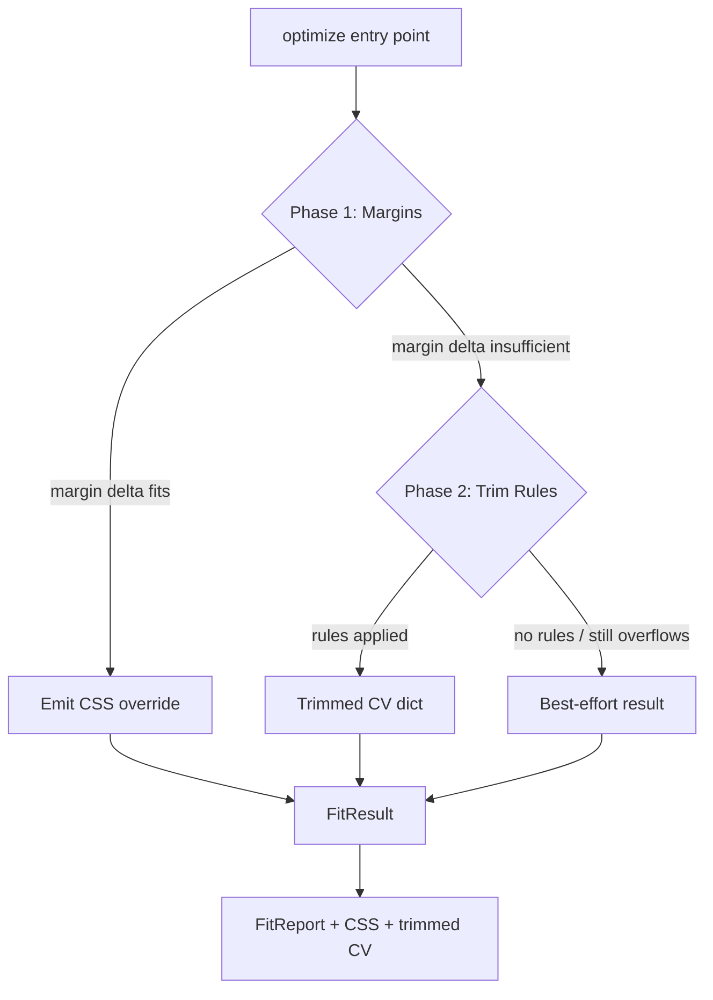

# Auto-Fit Two-Phase Optimizer — Margins First, Content Second

**Version**: 1.0 / **Created**: 2026-05-12 / **Author**: Orlando Bruno / **Status**: Implemented / **Area**: fit (Auto-fit / layout optimization) / **Related Documents**: ADR-006__fit__immutable-data-patterns.md

## Executive Summary

CV content frequently overflows a target page count. The auto-fit optimizer resolves overflow in two ordered phases: Phase 1 reduces page margins within a configured range; Phase 2 applies template-declared trim rules (remove items, reduce bullets, truncate text). Margins are the least disruptive lever — gaining a few lines this way preserves all content. Trim rules are only invoked when margin adjustment is insufficient, and are constrained by template-declared guards so templates retain control over what may be trimmed.

---

## 1. Problem Statement

### Context

Paperwork generates PDFs from structured YAML profiles. When a user's content exceeds the target page count — most commonly one page — they currently must edit CSS or trim content by hand. The engine has no automated mechanism to close the gap.

### Desired Outcome

- The optimizer reduces page count to the configured target automatically.
- All content changes are explainable and bounded — no silent data loss.
- The approach is gentle: content is trimmed only as a last resort.
- Templates can declare what is trimmable and set minimum-retention guards.
- A `--fit-report` flag surfaces exactly what the optimizer did and why.

---

## 2. Architecture Overview



**Phase 1** steps the page margin from `margin_max_mm` down to `margin_min_mm` in `margin_step_mm` increments. At each step it calls `estimate_all()` / `total_lines()` to measure content size and checks whether the content now fits. If it does, it emits a CSS override string and stops.

**Phase 2** is entered only if Phase 1 cannot close the gap. It applies each `TrimRule` declared in `LayoutParams` in priority order, iterating until the content fits or all rules are exhausted.

**`FitReport`** records which phases ran, the margin delta applied, and the number and type of items trimmed. It is emitted when the `--fit-report` flag is set.

---

## 3. Options Considered

### Option A — Two-phase: margins first, then content trimming (chosen)

**Description**: Phase 1 reduces margins; Phase 2 applies template-declared trim rules only if Phase 1 is insufficient.

Pros:
- Margins are the gentlest intervention — all content is preserved when Phase 1 succeeds.
- Content trimming is bounded by `min_items` / `min_bullets` / `min_words` guards declared in the template.
- Each phase is independently testable and its contribution is visible in `FitReport`.
- Predictable, explainable results.

Cons:
- More implementation complexity than single-phase approaches.
- Line estimator approximation means Phase 1 may not perfectly predict actual WeasyPrint output.

### Option B — Content trimming only

**Description**: Skip margin adjustment; immediately apply trim rules.

Pros:
- Simpler implementation.

Cons:
- Degrades content quality unnecessarily when a small margin change would suffice.
- No gentle fallback — first intervention is always destructive.

### Option C — Font size reduction

**Description**: Reduce body font size until content fits the target page count.

Pros:
- Simple single-parameter adjustment.

Cons:
- Degrades readability uniformly.
- Ignores template design intent (fonts are chosen deliberately).
- No per-section granularity.

### Option D — Manual only

**Description**: No auto-fit; the user adjusts content and CSS manually.

Pros:
- Zero risk of unwanted trimming.

Cons:
- Provides no automation value.
- Forces every user to understand CSS layout details.

---

## 4. Chosen Solution

**Decision**: Option A — two-phase optimizer: margins first, content trim second.

**Rationale**: Margins are a layout parameter, not content — adjusting them within the configured range loses nothing. Phase 2 trim rules are gated by template-declared guards (`min_items`, `min_bullets`, `min_words`), so templates control the floor. The `FitReport` makes the optimizer's decisions auditable, which is important when content is modified on the user's behalf. This approach delivers automation without silent data loss.

---

## 5. Implementation Specification

### Components

| Component | Location | Responsibility |
|-----------|----------|----------------|
| `optimize()` | `src/paperwork/autofit/optimizer.py` | Entry point; orchestrates Phase 1 and Phase 2; returns `FitResult` |
| `_phase_margins()` | `src/paperwork/autofit/optimizer.py` | Steps margin from `margin_max_mm` to `margin_min_mm`; emits CSS override |
| `_phase_trim()` | `src/paperwork/autofit/optimizer.py` | Applies `TrimRule` list from `LayoutParams` in priority order |
| `estimate_all()` / `total_lines()` | `src/paperwork/autofit/optimizer.py` | Line-count estimator used by both phases |
| `FitResult` | `src/paperwork/autofit/optimizer.py` | Output container: trimmed CV dict, CSS overrides, `FitReport` |
| `FitReport` | `src/paperwork/autofit/optimizer.py` | Diagnostic: phases used, margin delta, items trimmed |
| `LayoutParams` | `src/paperwork/autofit/params.py` | Configuration: `margin_max_mm`, `margin_min_mm`, `margin_step_mm`, `TrimRule` list |
| `TrimRule` | `src/paperwork/autofit/params.py` | Declares field, strategy, and guards for one trimmable section |

### Key Interfaces

```python
@dataclass
class FitResult:
    cv_dict: dict          # Trimmed CV data (plain dict, never mutated input)
    css_override: str      # CSS margin override string (empty if Phase 1 not needed)
    report: FitReport

@dataclass
class FitReport:
    phases_used: list[str]        # e.g. ["margins", "trim"]
    margin_delta_mm: float        # How much margin was reduced
    items_trimmed: list[str]      # Human-readable log of trim actions

def optimize(cv_dict: dict, config: LayoutParams) -> FitResult: ...
```

### Trim Strategies

| Strategy | Behaviour | Guards |
|----------|-----------|--------|
| `REMOVE_ITEMS_FROM_END` | Removes the last item from a list section | `min_items` |
| `REMOVE_BULLETS_THEN_ENTRIES` | Reduces bullet points per work experience entry before removing entries | `min_bullets` |
| `TRUNCATE_WORDS` | Truncates text fields to a word limit | `min_words` |

---

## 6. Performance & Cost

- **Line estimator**: O(n) over CV fields; negligible cost for CV-sized data (< 200 fields).
- **Phase 1 iterations**: bounded by `(margin_max_mm - margin_min_mm) / margin_step_mm` — typically 5–15 steps.
- **Phase 2 iterations**: bounded by the number of `TrimRule` entries declared in the template — typically < 10.
- **Memory**: each optimizer pass operates on a plain dict; no PDF rendering is triggered during estimation. WeasyPrint is called only for the final output.
- **No external calls**: the optimizer is fully local; no network or subprocess overhead.

---

## 7. Quality Assurance & Validation

### Success Metrics

- Auto-fit closes the overflow gap for ≥ 90% of test CVs without invoking Phase 2.
- When Phase 2 is invoked, `min_items` / `min_bullets` / `min_words` guards are always respected.
- `FitReport` accurately reflects the actions taken in every run.

### Testing Strategy

- Unit tests for `_phase_margins()`: verify CSS override string format and step count.
- Unit tests for `_phase_trim()`: verify each strategy against a fixture CV dict with known line counts.
- Unit tests for `estimate_all()` / `total_lines()`: verify against hand-counted fixture data.
- Integration tests: run `optimize()` on fixture CV dicts and assert page count reduction.
- Guard tests: assert that `min_items` / `min_bullets` / `min_words` thresholds are never violated.

---

## 8. Risks & Mitigation

| Risk | Likelihood | Impact | Mitigation |
|------|-----------|--------|-----------|
| Line estimator diverges from WeasyPrint output | Medium | Medium | Treat estimator as approximation; surface discrepancy in `FitReport`; allow re-run |
| Trim rules remove meaningful content | Low | High | `min_items` / `min_bullets` / `min_words` guards; user can override trim config |
| `--fit-report` output misleads user | Low | Medium | Report is informational only; documentation states user must verify the output PDF |
| Phase 1 over-reduces margins below readability threshold | Low | Low | `margin_min_mm` is a hard floor; template declares this value deliberately |

---

## 9. Implementation Roadmap

1. Implement `LayoutParams` and `TrimRule` dataclasses with validation.
2. Implement `estimate_all()` / `total_lines()` line estimator.
3. Implement `_phase_margins()` with CSS override emission.
4. Implement `_phase_trim()` with all three strategies.
5. Implement `FitReport` and `FitResult` containers.
6. Wire `optimize()` entry point.
7. Add `--fit-report` CLI flag.
8. Write unit and integration tests.
9. Validate against a set of real-world CV fixtures.

---

## 10. Decision Log

| Date | Author | Change |
|------|--------|--------|
| 2026-05-12 | Orlando Bruno | Initial decision — Option A chosen over B, C, D |

---

## 11. Success Criteria

- `optimize()` returns a `FitResult` with the trimmed CV dict and CSS overrides that, when rendered by WeasyPrint, produces output at or below the target page count.
- The original `cv_dict` passed to `optimize()` is unchanged after the call.
- `FitReport` contains an accurate account of all phases used and actions taken.
- Template-declared guards (`min_items`, `min_bullets`, `min_words`) are never violated.

---

## 12. Related Documents

- `ADR-006__fit__immutable-data-patterns.md` — immutability contract governing how `optimize()` handles CV data
- `_Design/04_Specs/` — detailed specification for `LayoutParams` and `TrimRule` schema

---

**Last Updated**: 2026-05-12 by Orlando Bruno
