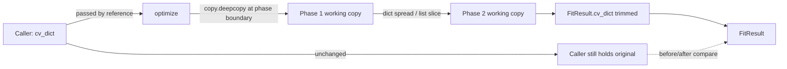

# Immutable Data Patterns in the Auto-Fit Optimizer

**Version**: 1.0 / **Created**: 2026-05-12 / **Author**: Orlando Bruno / **Status**: Implemented / **Area**: fit / **Related Documents**: ADR-005__fit__two-phase-optimizer.md

## Executive Summary

The auto-fit optimizer transforms CV data through multiple phases. Every transformation produces a new dict or list — the input `cv_dict` passed to `optimize()` is never modified. This immutability contract protects the source profile on disk, makes each phase independently testable, and enables before/after comparison via the `FitResult` container. The approach aligns with the engine's pure-function design principle.

---

## 1. Problem Statement

### Context

The auto-fit optimizer (ADR-005) applies two phases of transformation to CV data: margin reduction (emits CSS) and content trimming (modifies data). Content trimming creates new versions of sections, entries, and fields. A key design decision is whether these transformations mutate the input data in place or produce new data structures at each step.

### Desired Outcome

- The source profile YAML on disk is never affected by an optimizer run (hard NFR).
- The `cv_dict` the caller passes to `optimize()` is unchanged after the call returns.
- Each phase is independently testable with known, stable inputs.
- The `FitResult` can carry both the original and trimmed CV for before/after comparison.
- The implementation follows a consistent, reviewable pattern.

---

## 2. Architecture Overview



`optimize()` accepts a plain `dict` (from `CVData.model_dump()`), not the `CVData` object itself. This signals clearly that the function operates on plain data, not the domain model. A `copy.deepcopy` at the phase boundary ensures the working copy is fully independent. Within each phase, transformations use dict spread and list slices — no assignment to existing dicts or lists.

---

## 3. Options Considered

### Option A — Immutable: always produce new dicts and lists (chosen)

**Description**: Every transformation creates a new dict or list. The original `cv_dict` is never modified. Each phase returns a new data structure.

Pros:
- Source profile file is guaranteed safe — no code path can accidentally propagate changes to disk.
- Each phase is independently testable: pass a fixture dict in, assert the output dict, verify the input is unchanged.
- `FitResult` can hold both original and trimmed CV without extra bookkeeping.
- Consistent with pure-function design: given the same inputs, `optimize()` always returns the same output.
- Bugs introduced by incorrect phase ordering are immediately visible (wrong output, not corrupted shared state).

Cons:
- Slightly more code than in-place mutation (explicit spreads and slices).
- Dict spread only shallow-copies — nested objects are shared (mitigated by scoping, see Section 5).

### Option B — In-place mutation

**Description**: Modify the input dict directly throughout the optimizer.

Pros:
- Less code; no spread/slice boilerplate.

Cons:
- The caller's `cv_dict` is silently altered after `optimize()` returns — a hidden side effect.
- If the caller derived `cv_dict` from `CVData.model_dump()` and held a reference, the domain model state becomes inconsistent.
- If YAML serialization is triggered on the original object after an optimizer run, modified data could reach the disk.
- Phase ordering bugs corrupt shared state silently — harder to detect and reproduce.

### Option C — Deep copy at entry only, then mutate freely

**Description**: Copy once at the start of `optimize()`, then mutate the copy throughout.

Pros:
- Protects the caller from side effects.
- Less boilerplate than full immutability.

Cons:
- Intermediate states within the optimizer are mutable — phase B can corrupt state from phase A if code is reordered.
- Harder to test individual phases in isolation (each phase depends on the shared mutable copy).
- Does not support carrying both original and trimmed CV in `FitResult` without an additional copy.

---

## 4. Chosen Solution

**Decision**: Option A — fully immutable patterns throughout the optimizer.

**Rationale**:

1. **Disk safety (NFR)**: The source profile must never be modified by an optimizer run. Full immutability makes this trivially true — no code path touches the original dict.
2. **Testability**: Each phase can be tested by passing a known dict and asserting the returned dict, with no setup or teardown of shared state.
3. **Before/after comparison**: `FitResult` holds the original `cv_dict` (caller reference) and the trimmed `cv_dict` without any additional copying.
4. **Design consistency**: The engine uses pure functions throughout. `optimize()` accepting a plain dict (not `CVData`) and returning a new dict is consistent with this principle.

---

## 5. Implementation Specification

### Components

| Component | Location | Immutability Role |
|-----------|----------|------------------|
| `optimize()` | `src/paperwork/autofit/optimizer.py` | Accepts `cv_dict`, never modifies it; passes deepcopy to phases |
| `_phase_margins()` | `src/paperwork/autofit/optimizer.py` | Reads from working copy; emits CSS string only — no data mutation |
| `_phase_trim()` | `src/paperwork/autofit/optimizer.py` | Applies dict spread / list slice patterns; returns new dict at each step |
| `FitResult` | `src/paperwork/autofit/optimizer.py` | Holds trimmed CV dict; original remains with caller |

### Key Patterns

```python
# Dict spread — new dict with one updated field
current = {**current, rule.field: trimmed_value}

# List slice — new list without the last item
new_items = items[:-1]

# Entry update — new entry dict with modified roles list
new_entry = {**entry, "roles": roles[:-1]}

# Deep copy at phase boundary — working copy fully independent of caller's dict
current = copy.deepcopy(cv_dict)
```

### Shallow vs Deep Copy Scoping

Dict spread (`{**d, key: val}`) produces a shallow copy — nested objects within the dict are still shared with the original. This is safe under the current schema because:

- Trim rules target specific known fields (string lists, entry lists).
- Each targeted field is replaced wholesale via spread, not mutated in place.
- No optimizer code dereferences nested objects and modifies their internals.

If schema depth increases in the future, `copy.deepcopy` should be applied at the relevant phase boundary rather than converting every spread to a deep copy.

### Entry Point Contract

```python
def optimize(cv_dict: dict, config: LayoutParams) -> FitResult:
    """
    Transform cv_dict to fit the target page count.

    Args:
        cv_dict: Plain dict from CVData.model_dump(). Never modified.
        config:  LayoutParams controlling margins and trim rules.

    Returns:
        FitResult with trimmed CV dict, CSS overrides, and FitReport.
        The input cv_dict is guaranteed unchanged after this call.
    """
```

`optimize()` takes `cv_dict` from `CVData.model_dump()`, not the `CVData` object itself. This makes the function's scope explicit: it operates on plain serialisable data, not the live domain model.

---

## 6. Performance & Cost

- **Deep copy cost**: `copy.deepcopy` on a CV dict (< 200 fields, nested depth ≤ 4) is sub-millisecond. Cost is incurred once per `optimize()` call at the phase boundary.
- **Dict spread cost**: O(n) in the number of keys in the dict being spread. For CV-sized dicts (< 50 keys per entry), negligible.
- **List slice cost**: O(k) where k is the number of items in the list. Negligible for CV-sized sections (< 20 items).
- **Memory**: Each trim step allocates a new dict. For a CV with 20 entries and 5 trim iterations, this is 100 small dicts — well within normal process memory.

---

## 7. Quality Assurance & Validation

### Success Metrics

- After every `optimize()` call, the input `cv_dict` is byte-for-byte identical to its pre-call state.
- No phase modifies a dict or list that was created in a prior phase.
- `FitResult.cv_dict` is a distinct object from the input `cv_dict` (verified by `is not` assertion).

### Testing Strategy

- **Immutability regression tests**: For every trim strategy, assert that `cv_dict` passed to `optimize()` is unchanged after the call (use `copy.deepcopy` of the input before the call and compare with `==` after).
- **Identity tests**: Assert `result.cv_dict is not cv_dict` to confirm a new object was returned.
- **Phase isolation tests**: Test `_phase_margins()` and `_phase_trim()` independently with fixture dicts; verify neither modifies its input.
- **Shallow copy safety tests**: Verify that spread operations on nested entries do not affect sibling entries in the same list.

---

## 8. Risks & Mitigation

| Risk | Likelihood | Impact | Mitigation |
|------|-----------|--------|-----------|
| Dict spread only shallow-copies; future deep nesting causes shared-state bug | Low | High | Document scoping rule; add `copy.deepcopy` at phase boundary if schema depth increases |
| Developer unfamiliar with the pattern uses direct assignment instead of spread | Medium | Medium | Linting rule or code review checklist item; pattern documented here and in inline comments |
| Memory overhead from many small dicts | Very Low | Low | CV data is small; no action needed unless profiling reveals an issue |
| `copy.deepcopy` misses a custom `__deepcopy__` on a future dataclass field | Very Low | Medium | Prefer plain dicts throughout the optimizer; avoid dataclasses in `cv_dict` |

---

## 9. Implementation Roadmap

1. Establish the `copy.deepcopy` entry boundary in `optimize()` and document the contract in the docstring.
2. Implement `_phase_margins()` (read-only on working copy — no dict writes needed).
3. Implement `_phase_trim()` using dict spread and list slice patterns for all three trim strategies.
4. Add immutability regression tests for each trim strategy.
5. Add identity and shallow-copy safety tests.
6. Add a linting comment or code review checklist item to the project's contributing guide.

---

## 10. Decision Log

| Date | Author | Change |
|------|--------|--------|
| 2026-05-12 | Orlando Bruno | Initial decision — Option A chosen over B and C |

---

## 11. Success Criteria

- `optimize()` returns a `FitResult` whose `cv_dict` is a new object distinct from the input.
- The input `cv_dict` is identical before and after every `optimize()` call, verified by automated tests.
- All trim strategies use dict spread or list slice — no direct mutation of existing dicts or lists.
- The shallow-copy scoping rule is documented and understood by all contributors.

---

## 12. Related Documents

- `ADR-005__fit__two-phase-optimizer.md` — overall optimizer design that this immutability contract supports
- `_Design/04_Specs/` — detailed specification for `LayoutParams`, `TrimRule`, and `FitResult` schema

---

**Last Updated**: 2026-05-12 by Orlando Bruno
