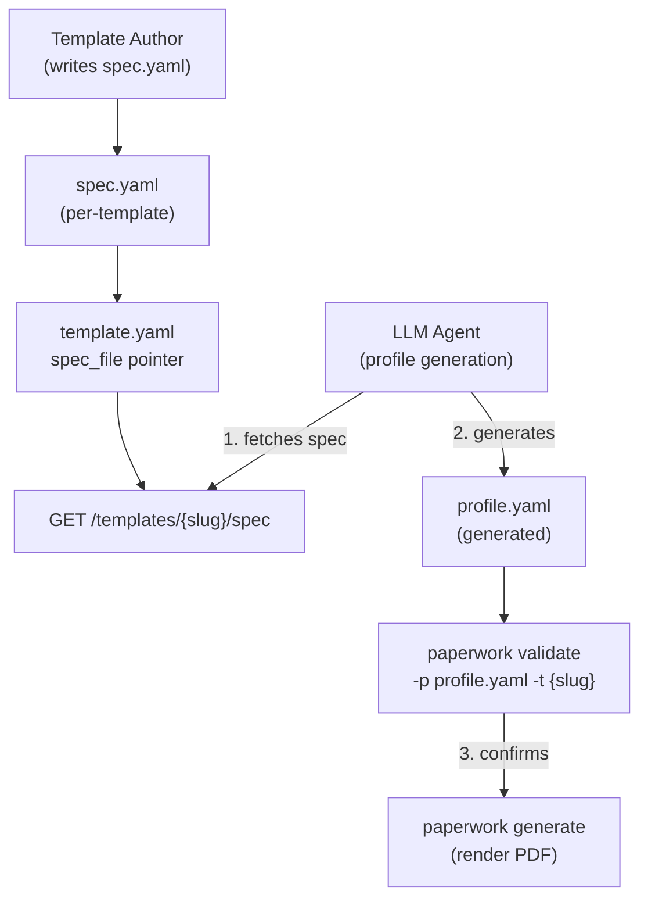

# Machine-Readable spec.yaml for LLM-Assisted Profile Generation

**Version**: 1.0
**Created**: 2026-05-12
**Author**: Orlando Bruno
**Status**: Implemented
**Area**: tpl (Template system)
**Related Documents**: `ADR-002__tpl__template-format.md`, `ADR-008__sys__photo-field-design.md`, `templates/classic/spec.yaml`, `templates/classic/template.yaml`

---

## Executive Summary

Paperwork's primary workflow is: user picks a template → generates a profile YAML adapted to that template → renders PDF. With LLMs capable of generating structured YAML, a machine-readable description of each template's fields, types, constraints, and layout context enables automated profile generation without manual authoring. This ADR defines `spec.yaml` — a per-template file that documents every field with required/optional status, type, description, constraints (max_chars, max_items), and layout context — as the mechanism for exposing this information. The spec is referenced from `template.yaml` via a `spec_file` pointer and exposed via a `GET /templates/{slug}/spec` API endpoint, making it accessible to both local tooling and remote LLM agents.

---

## 1. Problem Statement

### Context

Paperwork's primary workflow is: user picks a template → generates a profile YAML adapted to that template → renders PDF. With LLMs now capable of generating structured YAML, a machine-readable description of each template's fields, types, constraints, and layout context enables automated profile generation without manual authoring. The global `CVData` Pydantic schema documents the data model but does not capture template-specific rendering constraints — a field may exist in `CVData` but have a `max_items` of 3 in a given template because of layout space. The question is how to expose template-specific constraint information in a way that is useful to LLMs, template authors, and API consumers simultaneously.

### Desired Outcome

Define a mechanism that:
- Communicates field types, required/optional status, and natural-language descriptions to an LLM with no prior knowledge of Paperwork
- Captures template-specific constraints (max_chars, max_items) that differ from the global CVData schema
- Is readable by both humans (template authors) and machines (LLMs, validators)
- Keeps the contract between engine and template explicit and discoverable
- Is accessible without filesystem access (i.e., via an API endpoint)

---

## 2. Architecture Overview



The `spec.yaml` file lives inside each template directory alongside `template.yaml`, `cv.html`, and `style.css`. The `template.yaml` manifest references it via `spec_file: spec.yaml`. The engine exposes it at `GET /templates/{slug}/spec` so remote LLM agents can fetch it without filesystem access. After fetching the spec, an LLM generates a `profile.yaml`, which is validated before rendering.

---

## 3. Options Considered

### Option A: spec.yaml per template (chosen)

**Description**: Each template directory includes a `spec.yaml` that documents every field with: required/optional, type, description, constraints (max_chars, max_items), and layout context. Referenced from `template.yaml` via `spec_file` field. Exposed via `GET /templates/{slug}/spec` API endpoint.

**Pros**:
- Template-specific constraints are explicit and co-located with the template
- YAML format is readable by template authors without tooling
- Natural-language `description` fields provide LLMs with rendering context unavailable in a schema
- `spec_file` pointer in `template.yaml` makes the contract discoverable
- API endpoint makes the spec accessible to remote LLMs without filesystem access

**Cons**:
- Must be kept manually in sync with the template HTML — drift is possible
- Adds a new file for template authors to maintain alongside `template.yaml`, `cv.html`, and `style.css`
- Constraint values (max_chars, max_items) reflect CSS layout heuristics, not hard engine limits

---

### Option B: Derive spec from template.yaml required_fields/optional_fields

**Description**: The `template.yaml` manifest already lists field names under `required_fields` and `optional_fields`. No additional file needed; an LLM is given the field name list directly.

**Pros**:
- No new file to maintain
- Field list is already authoritative

**Cons**:
- Field names alone give an LLM no information about types, constraints, or how data is rendered
- An LLM generating `work_experience` has no way to know the template supports at most 7 entries, or that each role bullet should be under 160 characters
- Insufficient for generating layout-safe content

---

### Option C: JSON Schema per template

**Description**: A `schema.json` file per template following JSON Schema specification. Machine-readable and validatable with standard tooling.

**Pros**:
- Standard format with broad tooling support (validators, editors, documentation generators)
- Strict type constraints are machine-enforceable

**Cons**:
- More verbose than YAML — harder for template authors to read and write
- JSON Schema does not have a natural place for layout context fields (e.g., "max 4 items fit on one line at this font size")
- Less readable in a terminal or plain text editor compared to YAML

---

### Option D: No spec — rely on CVData schema only

**Description**: Direct LLMs to the global CVData Pydantic schema for field documentation. No per-template file.

**Pros**:
- Zero additional files
- CVData schema is already the authoritative data model

**Cons**:
- CVData documents the global data model, not per-template constraints
- A field valid in CVData may overflow the layout of a specific template
- LLMs have no way to know template-specific max_items or max_chars without a spec
- Entirely insufficient for LLM-guided generation targeting a specific template

---

## 4. Chosen Solution

**Decision**: Option A — `spec.yaml` per template

**Rationale**: Template-specific constraints (max_chars, max_items) are inherently per-template — they reflect the CSS layout of a specific template, not the global CVData schema. A separate `spec.yaml` is the only option that captures both field semantics (type, description) and layout constraints in a human-readable format. The `spec_file` pointer in `template.yaml` keeps the contract explicit and discoverable. The API endpoint makes the spec accessible to remote LLMs without requiring filesystem access, enabling the full LLM-assisted workflow without any changes to how users interact with the CLI.

---

## 5. Implementation Specification

### Components

| Component | Responsibility | Technology |
|---|---|---|
| `templates/{slug}/spec.yaml` | Document all template fields with types, constraints, and layout context | YAML |
| `templates/{slug}/template.yaml` | Reference spec via `spec_file: spec.yaml` | YAML |
| `src/paperwork/api/routes/templates.py` | Serve spec at `GET /templates/{slug}/spec` | FastAPI |
| `src/paperwork/engine/validator.py` | `paperwork validate -p profile.yaml -t {slug}` uses spec for constraint checking | Python |

### Key Interfaces

`spec.yaml` structure (from `templates/classic/spec.yaml`):

```yaml
template: classic
description: >
  Classic single-page CV layout. Two-column header...

fields:
  name:
    required: true
    type: string
    description: Candidate's full name. Rendered as H1.
    constraints:
      max_chars: 60

  work_experience:
    required: true
    type: list[object]
    description: Experience entries. Most recent first.
    constraints:
      max_items: 7
      recommended_items: 5
    fields:
      roles:
        required: false
        type: list[string]
        description: Bullet-point responsibilities. Lead with a strong verb.
        constraints:
          max_items: 5
          max_chars_per_item: 160

layout:
  page_size: Letter
  page_margin: 1cm
  font: Arial
  photo_size: 90px
```

`template.yaml` reference:

```yaml
spec_file: spec.yaml
```

API endpoint (FastAPI):

```python
@router.get("/templates/{slug}/spec")
async def get_template_spec(slug: str) -> dict:
    spec_path = TEMPLATES_DIR / slug / "spec.yaml"
    if not spec_path.exists():
        raise HTTPException(status_code=404, detail=f"No spec found for template '{slug}'")
    return yaml.safe_load(spec_path.read_text())
```

LLM workflow:

```
1. LLM fetches spec.yaml  →  GET /templates/{slug}/spec
2. LLM generates profile.yaml respecting field types and constraints
3. paperwork validate -p profile.yaml -t {slug}  →  confirms compatibility
4. paperwork generate  →  renders PDF
```

---

## 6. Performance & Cost

| Metric | Expected | Target |
|---|---|---|
| spec.yaml file size per template | 2–8 KB | < 20 KB |
| API response time for GET /templates/{slug}/spec | < 50 ms | < 200 ms |
| LLM token cost to process spec | ~500–1500 tokens | — |
| Validator overhead when checking spec constraints | < 100 ms | < 500 ms |

---

## 7. Quality Assurance & Validation

### Success Metrics

- [ ] `GET /templates/{slug}/spec` returns a valid YAML-deserialized dict for all bundled templates
- [ ] LLM-generated profile using classic spec passes `paperwork validate` on first attempt
- [ ] spec.yaml is parseable by PyYAML without errors for all bundled templates
- [ ] All fields listed in `template.yaml` `required_fields` are documented in the corresponding `spec.yaml`
- [ ] Constraint values in spec reflect actual template layout (verified by manual render tests)

### Testing Strategy

- **Unit tests**: Load each `spec.yaml` with PyYAML; assert required top-level keys (`template`, `description`, `fields`, `layout`) are present
- **Integration tests**: For each bundled template, generate a minimal profile using the spec (programmatically, without LLM) and assert it passes `paperwork validate`
- **Sync tests**: Assert every field in `template.yaml` `required_fields` appears as `required: true` in the corresponding `spec.yaml`
- **Manual**: Use the spec with an actual LLM and verify the generated profile renders without layout overflow

---

## 8. Risks & Mitigation

| Risk | Impact | Likelihood | Mitigation |
|---|---|---|---|
| spec.yaml drifts from template HTML (fields added to template, not to spec) | High | Medium | Sync test asserts all required_fields appear in spec; flag missing fields in CI |
| Constraint values (max_chars, max_items) are heuristic, not enforced by engine | Medium | High | Document clearly in spec.yaml that constraints reflect layout heuristics; CSS truncation is silent |
| LLM ignores constraints and generates content that overflows layout | Medium | Medium | `paperwork validate` checks constraint compliance before rendering; LLM prompt explicitly cites spec |
| spec.yaml file missing for a template | Low | Low | API returns 404 with clear message; validator skips constraint checks with warning |

---

## 9. Implementation Roadmap

### Phase 1: spec.yaml Authoring

- [x] Define `spec.yaml` schema with `template`, `description`, `fields`, `layout` top-level keys
- [x] Author `templates/classic/spec.yaml` with all fields, types, constraints, and layout section
- [x] Add `spec_file: spec.yaml` to `templates/classic/template.yaml`

### Phase 2: API Endpoint

- [x] Implement `GET /templates/{slug}/spec` in FastAPI routes
- [x] Return 404 with descriptive message if spec not found
- [x] Add endpoint to API documentation

### Phase 3: Validator Integration

- [x] Extend `paperwork validate` to load spec when `-t {slug}` is provided
- [x] Check profile fields against spec constraints (max_items, max_chars)
- [x] Report constraint violations as warnings (not errors) to keep validation non-blocking

---

## 10. Decision Log

| Date | Decision | Rationale |
|---|---|---|
| 2026-05-12 | Chose YAML over JSON Schema for spec format | More readable for template authors; supports inline layout context notes |
| 2026-05-12 | Added `spec_file` pointer to `template.yaml` rather than auto-discovering `spec.yaml` | Explicit contract — template authors must opt in by declaring the spec |
| 2026-05-12 | Constraint violations treated as warnings, not errors, in validator | LLM-generated content may slightly exceed soft limits without breaking the PDF; hard errors would block valid profiles |
| 2026-05-12 | Exposed spec via API endpoint in addition to filesystem | Remote LLM agents cannot access the filesystem; API makes the workflow complete without requiring local installation |

---

## 11. Success Criteria

- [ ] All bundled templates have a `spec.yaml` that is parseable and complete
- [ ] `GET /templates/{slug}/spec` is reachable and returns correct data for all bundled templates
- [ ] An LLM given only the spec can generate a profile that passes `paperwork validate` and renders without layout overflow
- [ ] Sync tests in CI catch spec/template drift within one commit
- [ ] Template authoring guide documents the spec.yaml format and constraint semantics

---

## 12. Related Documents

- `ADR-002__tpl__template-format.md` — Template format decision (HTML+CSS+Jinja2) that spec.yaml annotates
- `ADR-008__sys__photo-field-design.md` — Photo field is documented in spec.yaml with 90px constraint note
- `templates/classic/spec.yaml` — Primary implementation of this ADR
- `templates/classic/template.yaml` — Contains `spec_file` pointer
- `src/paperwork/api/routes/templates.py` — API endpoint implementation
- `src/paperwork/engine/validator.py` — Constraint validation using spec

---

**Last Updated**: 2026-05-12 by Orlando Bruno
