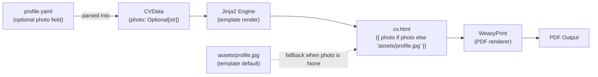

# Profile Photo as Optional CVData Field with Template Asset Fallback

**Version**: 1.0
**Created**: 2026-05-12
**Author**: Orlando Bruno
**Status**: Implemented
**Area**: sys (Data model / engine)
**Related Documents**: `ADR-007__tpl__spec-yaml-llm.md`, `src/paperwork/models/cv.py`, `templates/classic/cv.html`, `templates/classic/spec.yaml`

---

## Executive Summary

The `classic` template supports a profile photo (`supports_photo: true` in `template.yaml`). Before this decision, the photo was hardcoded in `cv.html` as a static asset path (`templates/assets/profile.jpg`), making it impossible to customise the photo through the profile without modifying template files directly. This conflates user content (photo) with template design (layout), violating the content/presentation separation principle. The solution adds `photo: Optional[str] = None` to `CVData` and updates the template to render `{{ photo if photo else 'assets/profile.jpg' }}`. When no photo is provided, the template's default asset is used — templates remain self-contained and functional out-of-the-box. This change also fixes a latent bug: the original hardcoded path `templates/assets/profile.jpg` only resolved correctly when running from the project root; the corrected fallback `assets/profile.jpg` resolves relative to the template directory URI in all execution contexts.

---

## 1. Problem Statement

### Context

The `classic` template supports a profile photo (`supports_photo: true` in `template.yaml`). Before this decision, the photo was hardcoded in `cv.html` as a static asset path (`templates/assets/profile.jpg`), making it impossible to customise the photo through the profile without modifying template files directly. This conflates user content (photo) with template design (layout), violating the content/presentation separation principle that the engine is built around: users provide data in `profile.yaml`, templates provide layout in HTML/CSS — users should never need to edit template files.

### Desired Outcome

Allow users to specify a custom profile photo via their `profile.yaml` while:
- Keeping templates self-contained and functional without a profile photo (fallback to default asset)
- Maintaining consistency with how all other profile fields work (declared in CVData, referenced in templates)
- Making the photo field accessible via API (JSON body) and LLM-generated profiles
- Fixing the latent path resolution bug in the original hardcoded implementation

---

## 2. Architecture Overview



`CVData` passes the `photo` value (a file path or URL, or `None`) to the Jinja2 template context. The template renders either the user-supplied photo or the template's bundled default asset. WeasyPrint resolves the asset path relative to `base_url` (the template directory URI), which is correct in all execution contexts.

---

## 3. Options Considered

### Option A: Photo as optional CVData field with asset fallback (chosen)

**Description**: Add `photo: Optional[str] = None` to `CVData`. Templates render `{{ photo if photo else 'assets/profile.jpg' }}`. When photo is absent, the template's default asset is used. User provides a file path or URL in their profile.

**Pros**:
- Preserves content/presentation separation — photo is user content, not template design
- Consistent with how all other profile fields work — no special-casing
- Fallback keeps templates self-contained and functional without a user photo
- Accessible via API (JSON body includes `photo` field) and LLM-generated profiles
- Documented in `spec.yaml` with constraint note (90×90px, square crop recommended)
- Fixes latent path resolution bug in original hardcoded implementation

**Cons**:
- `photo` field accepts any string — no URL validation or file existence check at profile load time
- Invalid paths produce a broken image in the PDF rather than an error
- Absolute file paths break in Docker unless the file is mounted — users deploying via API should use URLs

---

### Option B: Photo as static template asset only

**Description**: Keep the photo hardcoded in the template. User replaces `assets/profile.jpg` manually by editing template files.

**Pros**:
- No CVData changes required
- Simple — template authors already manage the assets directory

**Cons**:
- Forces users to modify template files to change their photo — directly violates content/presentation separation
- Template files are engine-managed; user edits are lost when templates are updated
- Photo change requires file replacement, not a profile edit — incompatible with API and LLM workflows
- Does not fix the path resolution bug (path still only resolves from project root)

---

### Option C: Photo as a separate CLI flag

**Description**: `paperwork generate --photo path/to/photo.jpg`. Photo is injected at render time without touching CVData or the profile.

**Pros**:
- Keeps CVData clean — no optional field added
- Explicit CLI surface — photo is clearly a render-time override

**Cons**:
- CLI-only feature — not available via API or LLM-generated profiles
- Inconsistent with how all other profile fields work — creates a two-tier system
- Photo path is not recorded in the profile — `profile.yaml` alone does not fully describe the rendered output

---

### Option D: Photo via extra dict

**Description**: Store photo path in `extra.photo` (an untyped dict field in CVData for arbitrary extensions).

**Pros**:
- No formal CVData schema change — purely additive
- Works with existing CVData serialization

**Cons**:
- Undiscoverable — not in the standard schema, not validated, not documented in CVData
- Not accessible via typed API — requires callers to know the `extra` convention
- Bypasses Pydantic validation — no type checking on the photo value
- Cannot be documented in spec.yaml as a first-class field

---

## 4. Chosen Solution

**Decision**: Option A — `photo: Optional[str] = None` in CVData with Jinja2 template fallback

**Rationale**: (1) Preserves content/presentation separation — the photo is user content, not template design; modifying template files to change a photo violates the engine's core principle. (2) Consistent with how all other profile fields work — no special-casing in the engine or CLI. (3) The fallback to `assets/profile.jpg` keeps templates self-contained and working out-of-the-box without a profile photo. (4) Accessible via API and LLM-generated profiles — the full automation workflow works without any special handling. (5) The fix to `base_url`-relative path resolution is a necessary correctness fix regardless of which option is chosen.

---

## 5. Implementation Specification

### Components

| Component | Responsibility | Change |
|---|---|---|
| `src/paperwork/models/cv.py` | Declare photo field in CVData | Add `photo: Optional[str] = None` |
| `templates/classic/cv.html` | Render photo with fallback | `src="{{ photo if photo else 'assets/profile.jpg' }}"` |
| `templates/classic/spec.yaml` | Document photo field for LLMs and template authors | Add `photo` entry with type, description, and 90px constraint note |
| `templates/classic/assets/profile.jpg` | Default fallback photo asset | Existing file; remains in place |

### Key Interfaces

CVData model (`src/paperwork/models/cv.py`):

```python
from typing import Optional
from pydantic import BaseModel

class CVData(BaseModel):
    name: str
    photo: Optional[str] = None
    # ... other fields
```

Template rendering (`templates/classic/cv.html`):

```html

```

spec.yaml documentation (`templates/classic/spec.yaml`):

```yaml
  photo:
    required: false
    type: string
    description: >
      File path or URL to the candidate's profile photo. Square crop recommended.
      When omitted, the template's default placeholder asset is used.
    constraints:
      recommended_size: 90x90px
      formats: [jpg, png, webp]
```

API usage (JSON body):

```json
{
  "name": "Jane Smith",
  "photo": "https://example.com/photos/jane.jpg",
  "work_experience": [...]
}
```

---

## 6. Performance & Cost

| Metric | Expected | Target |
|---|---|---|
| CVData parse overhead for photo field | Negligible (<1 ms) | — |
| Template render overhead (photo vs no photo) | None — same Jinja2 conditional | — |
| WeasyPrint image fetch time (local file) | < 50 ms | < 200 ms |
| WeasyPrint image fetch time (remote URL) | 100–500 ms (network-dependent) | < 2 s |
| Broken image (invalid path) render time | Same as valid — silent failure | — |

---

## 7. Quality Assurance & Validation

### Success Metrics

- [ ] Profile with `photo: null` (or omitted) renders with the default `assets/profile.jpg` placeholder
- [ ] Profile with `photo: /absolute/path/to/photo.jpg` renders with the specified photo
- [ ] Profile with `photo: https://example.com/photo.jpg` renders with the remote photo
- [ ] Render succeeds from any working directory (base_url path fix verified)
- [ ] Render succeeds in Docker with a mounted photo file and a URL-based photo

### Testing Strategy

- **Unit tests**: Instantiate `CVData` with and without `photo`; assert field is `None` by default and accepts any string
- **Integration tests**: Render `classic` template with (a) no photo, (b) local file path, (c) URL; assert PDF is non-empty and page count is correct
- **Path resolution test**: Run render from a temp directory (not project root); assert default fallback renders correctly (regression test for the latent bug)
- **Docker test**: Build Docker image, mount a local photo file, render via API with a file path and a URL; assert both succeed

---

## 8. Risks & Mitigation

| Risk | Impact | Likelihood | Mitigation |
|---|---|---|---|
| Invalid photo path produces silent broken image in PDF | Medium | Medium | Document in spec.yaml and CLI help that invalid paths are not validated at load time; future work: add path existence check in validator |
| Absolute file paths break in Docker (file not mounted) | Medium | Low | Document in README and API docs that Docker deployments should use URLs for photo; API example uses URL |
| Remote URL photo fetch adds latency to render | Low | Low | WeasyPrint fetches synchronously; acceptable for a CLI tool; document expected behaviour |
| Default fallback asset removed or renamed by template update | Low | Low | Fallback path is `assets/profile.jpg` — stable convention; CI render test with no photo catches missing asset |

---

## 9. Implementation Roadmap

### Phase 1: CVData Model Change

- [x] Add `photo: Optional[str] = None` to `CVData` in `src/paperwork/models/cv.py`
- [x] Verify existing profiles without `photo` field continue to load correctly (backward compatible)

### Phase 2: Template Update

- [x] Update `templates/classic/cv.html` to render `{{ photo if photo else 'assets/profile.jpg' }}`
- [x] Fix base_url-relative path (remove `templates/` prefix from fallback — resolves correctly from template directory URI)
- [x] Verify default placeholder renders correctly from any working directory

### Phase 3: spec.yaml Documentation

- [x] Add `photo` field to `templates/classic/spec.yaml` with type, description, and constraint note
- [x] Note 90×90px recommended size and square crop recommendation

---

## 10. Decision Log

| Date | Decision | Rationale |
|---|---|---|
| 2026-05-12 | Added `photo` to CVData as `Optional[str]` rather than a more specific type | String accepts both file paths and URLs; Pydantic `AnyUrl` would reject valid local paths |
| 2026-05-12 | Used Jinja2 conditional `{{ photo if photo else 'assets/profile.jpg' }}` rather than engine-level default injection | Keeps default logic in the template where layout decisions belong; engine remains unaware of photo fallback |
| 2026-05-12 | Fixed fallback path from `templates/assets/profile.jpg` to `assets/profile.jpg` | Original path only resolved from project root; corrected path resolves relative to base_url (template directory URI) in all contexts |
| 2026-05-12 | No URL validation or file existence check at profile load time | Consistent with how other string fields (e.g., LinkedIn URL) are handled; validation is the user's responsibility; silent failure is acceptable for an image |

---

## 11. Success Criteria

- [ ] `CVData` accepts `photo: null` (default), local file path, and URL without validation errors
- [ ] `classic` template renders correctly with no photo (default asset), local photo, and remote URL photo
- [ ] Render from any working directory uses correct base_url-relative fallback path (regression test passes)
- [ ] `photo` field is documented in `spec.yaml` and included in API schema
- [ ] Existing profiles without a `photo` field continue to load and render without modification

---

## 12. Related Documents

- `ADR-007__tpl__spec-yaml-llm.md` — spec.yaml format that documents the photo field with constraint notes
- `src/paperwork/models/cv.py` — CVData model with `photo: Optional[str] = None`
- `templates/classic/cv.html` — Template implementation with Jinja2 conditional and fallback
- `templates/classic/spec.yaml` — Photo field documentation for LLMs and template authors
- `templates/classic/assets/profile.jpg` — Default fallback asset
- `templates/classic/template.yaml` — `supports_photo: true` declaration

---

**Last Updated**: 2026-05-12 by Orlando Bruno
