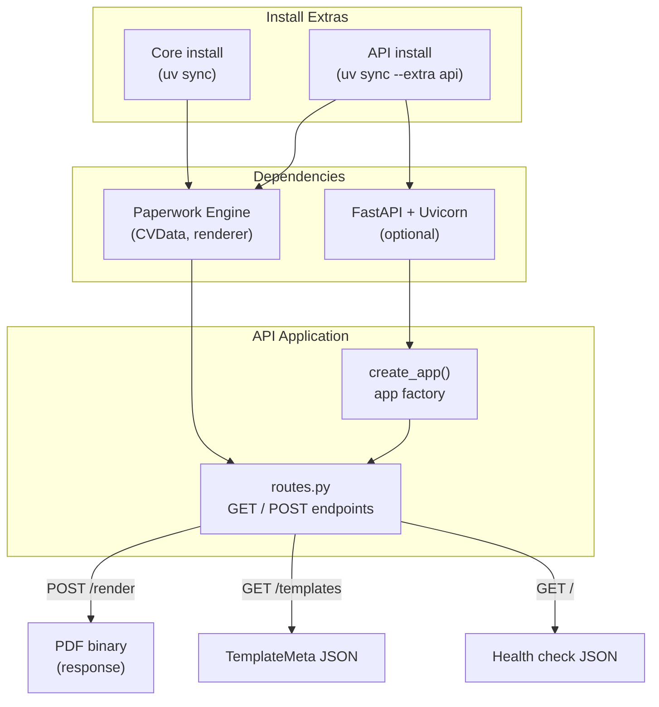

# FastAPI HTTP API as an Optional Install Extra

**Version**: 1.0
**Created**: 2026-05-12
**Author**: Orlando Bruno
**Status**: Implemented
**Area**: api
**Related Documents**: `pyproject.toml`, `src/paperwork/api/routes.py`, `docker-compose.yml`, `ADR-003__sys__engine-only-design.md`

---

## Executive Summary

Paperwork needs to support automated pipeline integrations where the rendering engine runs as a remote service and callers post profile data via HTTP to receive a PDF binary. FastAPI was selected as the HTTP framework and declared as an optional install extra (`uv sync --extra api`), keeping the core CLI install free of web framework dependencies. The app factory pattern (`create_app()`) isolates API code from the engine, and FastAPI's native Pydantic integration means `CVData` serves directly as the request body schema with no additional boilerplate.

---

## 1. Problem Statement

### Context

Paperwork needs to support automated pipeline integrations where the rendering engine runs as a remote service (Docker, server) and callers post profile data via HTTP to receive a PDF binary. This HTTP layer must not bloat the core CLI install for users who only need the CLI.

### Desired Outcome

Provide an HTTP API layer that:
- Allows remote callers to submit CV data and receive a rendered PDF
- Adds zero dependencies to the core CLI install for users who never use the API
- Reuses the existing Pydantic `CVData` schema as the request body model with no duplication
- Exposes automatic OpenAPI documentation for discoverability
- Deploys cleanly in Docker via `docker compose up`

---

## 2. Architecture Overview



FastAPI and Uvicorn are declared under `[project.optional-dependencies] api` in `pyproject.toml`. The engine and all Pydantic models are in the core package — the API layer imports from the engine, never the reverse.

---

## 3. Options Considered

### Option A: FastAPI as Optional Extra (chosen)

**Description**: FastAPI + Uvicorn declared under `[project.optional-dependencies] api`. Core install (`uv sync`) has zero web framework dependencies. API install is `uv sync --extra api`. App factory pattern (`create_app()`) keeps API code isolated from the engine.

**Pros**:
- CLI users pay zero cost — no web framework in their install
- Native Pydantic integration — `CVData` is the request body schema with zero boilerplate
- Automatic OpenAPI docs at `/docs` — self-documenting for integrators
- Async support via Uvicorn for future concurrency needs
- `create_app()` factory makes the app testable and configurable via env vars
- Clean separation — engine code has no knowledge of HTTP

**Cons**:
- Two install variants increase documentation surface slightly
- Developers must remember to use `--extra api` when working on the API layer

---

### Option B: Flask

**Description**: Flask + Gunicorn as the HTTP layer, declared as an optional extra.

**Pros**:
- Lighter than FastAPI (fewer transitive dependencies)
- Mature and well-understood

**Cons**:
- No automatic OpenAPI docs — integrators must read source or external docs
- No async support — blocking handlers only
- Request/response validation against Pydantic models requires manual wiring (Marshmallow or explicit `.model_validate()` calls)
- FastAPI's native Pydantic integration is a significantly better fit given the existing schema investment

---

### Option C: FastAPI as a Core Dependency

**Description**: FastAPI always installed as part of the base package.

**Pros**:
- No install variants — simpler documentation and onboarding

**Cons**:
- Adds ~15 MB and several transitive dependencies for users who never use the API
- Violates the CLI-first principle established in `ADR-003__sys__engine-only-design.md`
- Uvicorn running implicitly is confusing for CLI-only users

---

### Option D: Separate Repository

**Description**: API as a completely separate package that depends on the engine as a published PyPI library.

**Pros**:
- Cleanest architectural separation
- Independent release cadence for API and engine

**Cons**:
- Significant maintenance overhead for a small project
- Requires publishing the engine to PyPI before the API can declare a dependency
- Schema changes require coordinated version bumps across two repositories
- Adds complexity without proportionate benefit at current project scale

---

## 4. Chosen Solution

**Decision**: Option A — FastAPI as optional extra

**Rationale**: (1) CLI users pay zero cost for the API — the optional-dependencies mechanism in `pyproject.toml` is the idiomatic tool for this; (2) FastAPI's native Pydantic integration means `CVData` is the request body schema with zero boilerplate; (3) automatic OpenAPI docs at `/docs` — integrators can explore the API without reading source; (4) async support for future concurrency needs; (5) `create_app()` factory makes the app testable and configurable via env vars without coupling the factory to a specific runtime.

---

## 5. Implementation Specification

### Components

| Component | Responsibility | Technology |
|---|---|---|
| `pyproject.toml` | Declare `fastapi` and `uvicorn` under `[project.optional-dependencies] api` | PEP 508 optional extras |
| `src/paperwork/api/__init__.py` | Export `create_app()` factory | FastAPI `APIRouter` composition |
| `src/paperwork/api/routes.py` | Define all HTTP endpoints | FastAPI `APIRouter` |
| `src/paperwork/api/models.py` | Response schemas (`TemplateMeta`, `HealthResponse`) | Pydantic v2 |
| `docker-compose.yml` | Start Uvicorn on port 8000; mount template and profile volumes | Docker Compose v3 |

### Key Interfaces

App factory:

```python
from fastapi import FastAPI
from paperwork.api.routes import router

def create_app() -> FastAPI:
    app = FastAPI(title="Paperwork API", version="1.0.0")
    app.include_router(router)
    return app
```

Endpoint definitions (`src/paperwork/api/routes.py`):

```
GET  /                              — health check: {status, template_count}
GET  /templates                     — list all templates (TemplateMeta JSON array)
GET  /templates/{slug}/spec         — return raw spec.yaml content for LLM consumption
POST /render?template=classic       — render CVData JSON body → PDF binary
POST /render-cv                     — legacy: render with classic template (backward compat)
GET  /render/{profile_slug}         — render stored profile from RENDERCV_PROFILES_DIR
```

Render endpoint signature:

```python
from fastapi import APIRouter, Query
from fastapi.responses import Response
from paperwork.engine.models import CVData
from paperwork.engine.renderer import render_cv

router = APIRouter()

@router.post("/render")
async def render(
    cv_data: CVData,
    template: str = Query(default="classic"),
) -> Response:
    pdf_bytes = render_cv(cv_data, template_slug=template)
    return Response(content=pdf_bytes, media_type="application/pdf")
```

### Configuration (env vars)

| Variable | Default (Docker) | Purpose |
|---|---|---|
| `RENDERCV_TEMPLATES_DIR` | `/app/templates` | Templates directory |
| `RENDERCV_PROFILES_DIR` | `/app/profiles` | Server-side profile storage |

---

## 6. Performance & Cost

| Metric | Expected | Target |
|---|---|---|
| API install size delta (FastAPI + Uvicorn) | ~15 MB | < 30 MB |
| Core install size delta | 0 MB | 0 MB |
| Request latency (POST /render, single-page CV) | 4–8 s (render-bound) | < 15 s |
| Concurrent requests (single Uvicorn worker) | 1 (render is CPU-bound) | N/A — internal use |
| Docker image size delta (API deps only) | ~15 MB | < 30 MB |

---

## 7. Quality Assurance & Validation

### Success Metrics

- [ ] `uv sync` (no extras) installs without pulling in FastAPI or Uvicorn
- [ ] `uv sync --extra api` installs FastAPI and Uvicorn successfully
- [ ] `POST /render` with valid `CVData` JSON returns a non-empty PDF binary
- [ ] `GET /templates` returns the correct list of available templates
- [ ] `GET /docs` returns the OpenAPI UI without errors
- [ ] Docker Compose starts Uvicorn successfully and mounts both volumes

### Testing Strategy

- **Unit tests**: Test each route handler in isolation using FastAPI's `TestClient`; mock the engine renderer to return a fixed bytes object
- **Integration tests**: Start the full app with `create_app()` and `TestClient`; POST a standard CVData fixture to `/render` and assert the response is a valid PDF
- **Smoke test in Docker**: `docker compose up` followed by `curl -X POST http://localhost:8000/render` with a minimal fixture — assert HTTP 200 and non-empty body

---

## 8. Risks & Mitigation

| Risk | Impact | Likelihood | Mitigation |
|---|---|---|---|
| `POST /render-cv` legacy endpoint breaks silently if `classic` template slug is renamed | Medium | Low | Add an integration test that asserts the `classic` slug resolves; document the slug as stable in the template authoring guide |
| Large profile payloads cause memory issues (no request size limit configured) | Medium | Low | Deploy behind a reverse proxy (nginx) with `client_max_body_size` configured; document this as a deployment requirement |
| Public exposure without authentication leads to abuse | High | Low | Document explicitly that the API is designed for private network / Docker Compose internal networking; external exposure is deployer's responsibility |
| FastAPI version upgrade breaks Pydantic v2 integration | Medium | Low | Pin FastAPI minor version in `pyproject.toml`; run integration test suite before upgrading |

---

## 9. Implementation Roadmap

### Phase 1: Optional Extra Declaration

- [x] Add `fastapi` and `uvicorn[standard]` to `[project.optional-dependencies] api` in `pyproject.toml`
- [x] Create `src/paperwork/api/` package with `__init__.py` exporting `create_app()`

### Phase 2: Core Endpoints

- [x] Implement `GET /` health check
- [x] Implement `GET /templates` listing endpoint
- [x] Implement `POST /render` with `CVData` body and `?template=` query param
- [x] Implement `POST /render-cv` legacy endpoint

### Phase 3: Extended Endpoints

- [x] Implement `GET /templates/{slug}/spec` for spec.yaml content
- [x] Implement `GET /render/{profile_slug}` for server-side profile rendering

### Phase 4: Docker Integration

- [x] Add API service to `docker-compose.yml` with volume mounts for templates and profiles
- [x] Verify Uvicorn starts and serves requests inside the container

---

## 10. Decision Log

| Date | Decision | Rationale |
|---|---|---|
| 2026-05-12 | FastAPI over Flask | Native Pydantic integration eliminates validation boilerplate; automatic OpenAPI docs for integrators |
| 2026-05-12 | Optional extra over core dependency | CLI users must not pay the dependency cost of a feature they never use |
| 2026-05-12 | App factory (`create_app()`) pattern | Makes the app testable with `TestClient` and configurable via env vars without coupling to Uvicorn startup |
| 2026-05-12 | No authentication layer | Designed for private network use; adding auth would add scope without covering the primary use case |

---

## 11. Success Criteria

- [ ] Core install (`uv sync`) contains no FastAPI or Uvicorn imports
- [ ] `POST /render` returns a valid PDF binary for all bundled templates
- [ ] OpenAPI docs at `/docs` correctly reflect all endpoint schemas
- [ ] Docker Compose deployment starts without errors and handles at least one render request end-to-end
- [ ] All route handler unit tests pass with mocked engine

---

## 12. Related Documents

- `ADR-003__sys__engine-only-design.md` — Engine-only design principle that motivates the optional-extra approach
- `ADR-001__eng__pdf-rendering-library.md` — WeasyPrint rendering pipeline that the API wraps
- `pyproject.toml` — Optional dependency declaration
- `src/paperwork/api/routes.py` — Primary implementation site
- `docker-compose.yml` — Deployment configuration

---

**Last Updated**: 2026-05-12 by Orlando Bruno
