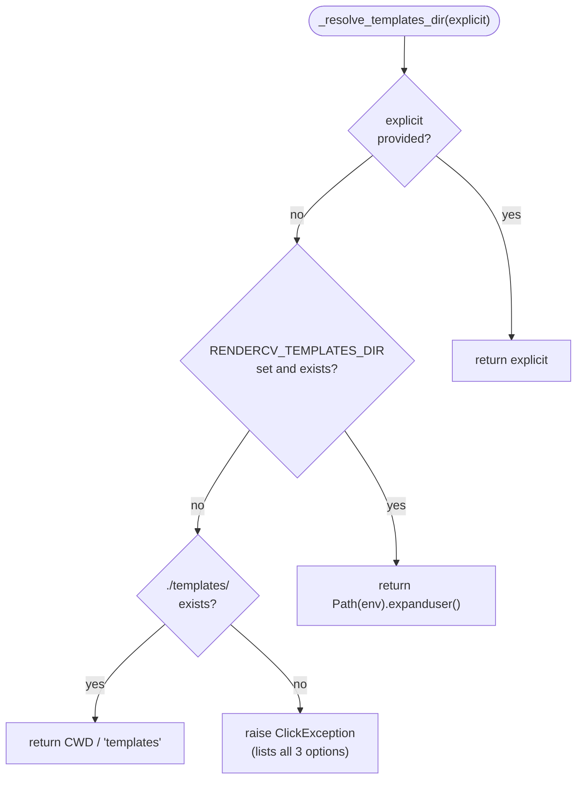

# Template Directory Resolution — Flag → Env Var → CWD

**Version**: 1.0
**Created**: 2026-05-12
**Author**: Orlando Bruno
**Status**: Implemented
**Area**: cli
**Related Documents**: `src/paperwork/cli.py`, `ADR-009__api__fastapi-optional-extra.md`, `ADR-003__sys__engine-only-design.md`

---

## Executive Summary

Paperwork needs to locate the templates directory at runtime. Templates are external to the engine — users manage them as directories on their filesystem. A three-level resolution chain was implemented: `--templates-dir` CLI flag overrides all; `RENDERCV_TEMPLATES_DIR` env var is checked second for persistent configuration; `./templates/` in the current working directory is the implicit fallback for local development. The same resolution logic is shared by both the CLI and the API, ensuring consistent behaviour across both interfaces.

---

## 1. Problem Statement

### Context

Paperwork needs to locate the templates directory at runtime. Templates are external to the engine — users manage them as directories on their filesystem. The resolution mechanism must support: local development (cd into project), persistent configuration (env var), and explicit override (flag). Resolution is the same for both CLI and API.

### Desired Outcome

Implement a templates directory resolution mechanism that:
- Supports explicit per-invocation overrides without configuration
- Supports persistent configuration without requiring a config file format
- Supports ergonomic local development with no flags or env vars
- Produces a clear, actionable error message when no valid path is found
- Works identically in the CLI and the API (Uvicorn) without duplication

---

## 2. Architecture Overview



Resolution is performed once at CLI group level (`@click.group`) and stored in `ctx.obj["templates_dir"]`. All subcommands access the resolved path from context — no subcommand re-runs the resolution logic.

---

## 3. Options Considered

### Option A: Three-Level Resolution — Flag → Env Var → CWD (chosen)

**Description**: `--templates-dir` flag overrides all. `RENDERCV_TEMPLATES_DIR` env var is checked second. `./templates/` in the current working directory is the implicit fallback. Error if none resolve to an existing path.

**Pros**:
- Flag gives maximum flexibility for scripts and one-off invocations
- Env var enables persistent configuration without a config file format or parser
- CWD fallback enables `cd project && paperwork templates` ergonomic workflow for local development
- The three levels cover all real usage patterns with no additional infrastructure
- Error message is self-documenting — lists all three resolution methods

**Cons**:
- CWD-based resolution means running `paperwork` from an unexpected directory silently skips the local fallback — mitigated by the clear error message

---

### Option B: Config File (e.g., `~/.paperworkrc`)

**Description**: Persistent user-level configuration file (TOML or INI) that stores `templates_dir` and other settings.

**Pros**:
- Persistent configuration with explicit, version-controllable file
- Can store multiple settings in one place as the project grows

**Cons**:
- Requires a config file format and a parser — additional scope and a format decision
- More setup friction for new users — must create and edit a config file before first use
- The env var already covers the persistent configuration use case without any additional infrastructure
- Two persistence mechanisms (env var + config file) for the same setting would be confusing

---

### Option C: Flag Only

**Description**: Require explicit `--templates-dir` on every invocation. No env var, no CWD fallback.

**Pros**:
- Zero ambiguity — the templates path is always explicit in the command
- No "where did that path come from?" debugging

**Cons**:
- Poor UX — users must type the full path on every invocation or maintain shell aliases
- Scripts and Makefiles accumulate repetitive `--templates-dir` arguments
- No ergonomic path for local development workflows

---

### Option D: Fixed System Path (e.g., `~/.paperwork/templates/`)

**Description**: Install templates to a well-known location; the tool always looks there.

**Pros**:
- Zero configuration — works out of the box after a one-time install step
- Simple to document

**Cons**:
- Opinionated file layout forced on all users — conflicts with project-local template development
- Cannot easily have multiple template sets (e.g., work vs. personal)
- No support for project-local templates without overriding the fixed path — which requires a flag anyway

---

## 4. Chosen Solution

**Decision**: Option A — three-level resolution (flag → env var → cwd)

**Rationale**: (1) The flag gives maximum flexibility for scripts and one-off invocations; (2) the env var enables persistent configuration without a config file format — no parser, no format decision, no setup friction; (3) the CWD fallback enables the `cd project && paperwork` ergonomic local development workflow; (4) the three levels cover all real usage patterns — new user (CWD fallback), power user (env var), scripting (flag) — with no additional infrastructure; (5) the error message listing all three options is self-documenting for users who encounter it for the first time.

---

## 5. Implementation Specification

### Components

| Component | Responsibility | Technology |
|---|---|---|
| `src/paperwork/cli.py` | `_resolve_templates_dir()` function and `@click.group` level resolution | Click, `pathlib.Path`, `os.environ` |
| `src/paperwork/api/routes.py` | Read `RENDERCV_TEMPLATES_DIR` via `Path(os.environ.get(...)).expanduser()` | `os.environ`, `pathlib.Path` |

### Key Interfaces

Resolution function (`src/paperwork/cli.py`):

```python
def _resolve_templates_dir(explicit: Path | None) -> Path:
    if explicit:
        return explicit
    from_env = os.environ.get("RENDERCV_TEMPLATES_DIR")
    if from_env:
        resolved = Path(from_env).expanduser()
        if resolved.exists():
            return resolved
    local = Path.cwd() / "templates"
    if local.exists():
        return local
    raise click.ClickException(
        "No templates directory found. Provide one via:\n"
        "  --templates-dir PATH\n"
        "  RENDERCV_TEMPLATES_DIR env var\n"
        "  ./templates/ in current directory"
    )
```

CLI group integration:

```python
@click.group()
@click.option("--templates-dir", type=click.Path(exists=True, file_okay=False), default=None)
@click.pass_context
def cli(ctx: click.Context, templates_dir: str | None) -> None:
    ctx.ensure_object(dict)
    ctx.obj["templates_dir"] = _resolve_templates_dir(
        Path(templates_dir) if templates_dir else None
    )
```

### Key Behaviours

| Behaviour | Implementation |
|---|---|
| `~` support in env var | `Path(from_env).expanduser()` applied before existence check |
| Stale env var path rejected | Env var path checked for existence before accepting — prevents silent use of a missing path |
| CWD fallback is conservative | Only triggers if `./templates/` actually exists — no accidental resolution in arbitrary directories |
| Error is self-documenting | Message lists all three resolution methods and their syntax |
| Consistent CLI + API | API reads `RENDERCV_TEMPLATES_DIR` with the same `Path(...).expanduser()` pattern |

---

## 6. Performance & Cost

| Metric | Expected | Notes |
|---|---|---|
| Resolution overhead per invocation | < 1 ms | Three existence checks at most |
| Resolution calls per CLI invocation | 1 | Resolved once at group level; stored in `ctx.obj` |
| Resolution calls per API request | 0 (startup only) | API resolves once at startup via env var |

---

## 7. Quality Assurance & Validation

### Success Metrics

- [ ] `--templates-dir` flag overrides env var and CWD fallback
- [ ] `RENDERCV_TEMPLATES_DIR` with `~` expands correctly and resolves to an existing path
- [ ] CWD fallback resolves correctly when `./templates/` exists
- [ ] Clear `ClickException` is raised (not a Python traceback) when no path resolves
- [ ] Error message text lists all three resolution options
- [ ] Resolution is called exactly once per CLI invocation (at group level)

### Testing Strategy

- **Unit tests**: Test `_resolve_templates_dir()` directly with parametrised cases: (explicit set), (explicit None, env var set, exists), (explicit None, env var set, missing), (explicit None, no env var, CWD has templates/), (explicit None, no env var, CWD has no templates/) — assert correct path returned or `ClickException` raised
- **Integration tests**: Invoke the CLI with `CliRunner` from Click's test utilities; set env vars via `env=` parameter; assert subcommands receive the resolved path in `ctx.obj`
- **Edge case tests**: `RENDERCV_TEMPLATES_DIR=~/my-templates` — assert tilde is expanded; env var points to a file (not a directory) — assert error raised

---

## 8. Risks & Mitigation

| Risk | Impact | Likelihood | Mitigation |
|---|---|---|---|
| Running `paperwork` from an unexpected directory silently fails to find templates via CWD fallback | Low | Medium | Error message explicitly lists all three options including `./templates/` — user knows why it failed |
| `RENDERCV_TEMPLATES_DIR` with `~` fails in API (Uvicorn) if `expanduser()` is not applied | Medium | Low | API reads env var with the same `Path(...).expanduser()` pattern — covered by integration test |
| Stale env var pointing to a deleted directory causes confusing failure | Medium | Low | Env var path is checked for existence before accepting; error message is raised if it does not exist |
| Resolution called multiple times per invocation (performance regression) | Low | Low | Resolution is at group level only; subcommands read from `ctx.obj` — enforced by code structure |

---

## 9. Implementation Roadmap

### Phase 1: Core Resolution Function

- [x] Implement `_resolve_templates_dir(explicit: Path | None) -> Path` in `src/paperwork/cli.py`
- [x] Add `expanduser()` to env var path resolution
- [x] Add existence check for env var path before accepting
- [x] Add CWD fallback (`Path.cwd() / "templates"`)
- [x] Implement `ClickException` with self-documenting error message

### Phase 2: CLI Group Integration

- [x] Add `--templates-dir` option to `@click.group`
- [x] Call `_resolve_templates_dir()` at group level
- [x] Store resolved path in `ctx.obj["templates_dir"]`
- [x] Verify all subcommands access path from `ctx.obj`

### Phase 3: API Consistency

- [x] Apply same `Path(os.environ.get(...)).expanduser()` pattern in API startup
- [x] Document env var in `docker-compose.yml` with default value

---

## 10. Decision Log

| Date | Decision | Rationale |
|---|---|---|
| 2026-05-12 | Three-level resolution (flag → env var → CWD) over flag-only or fixed path | Covers local dev, persistent config, and scripting use cases with no additional infrastructure |
| 2026-05-12 | Env var existence check before accepting | Prevents silent use of stale paths from old environments |
| 2026-05-12 | `expanduser()` on env var path | Users naturally write `~/my-templates` in env vars; silent failure without expansion would be surprising |
| 2026-05-12 | Resolution at CLI group level, stored in `ctx.obj` | Single resolution point per invocation; subcommands do not need to know the resolution logic |

---

## 11. Success Criteria

- [ ] All three resolution levels work correctly in automated tests
- [ ] Error message when no path resolves is tested and confirmed user-readable
- [ ] API and CLI use consistent resolution behaviour for `RENDERCV_TEMPLATES_DIR`
- [ ] No subcommand calls `_resolve_templates_dir()` directly — all read from `ctx.obj`

---

## 12. Related Documents

- `ADR-009__api__fastapi-optional-extra.md` — API layer that shares the `RENDERCV_TEMPLATES_DIR` env var
- `ADR-003__sys__engine-only-design.md` — Engine-only design; templates are external, making directory resolution a CLI/API concern
- `src/paperwork/cli.py` — Primary implementation site
- `src/paperwork/api/routes.py` — API-side env var consumption

---

**Last Updated**: 2026-05-12 by Orlando Bruno
