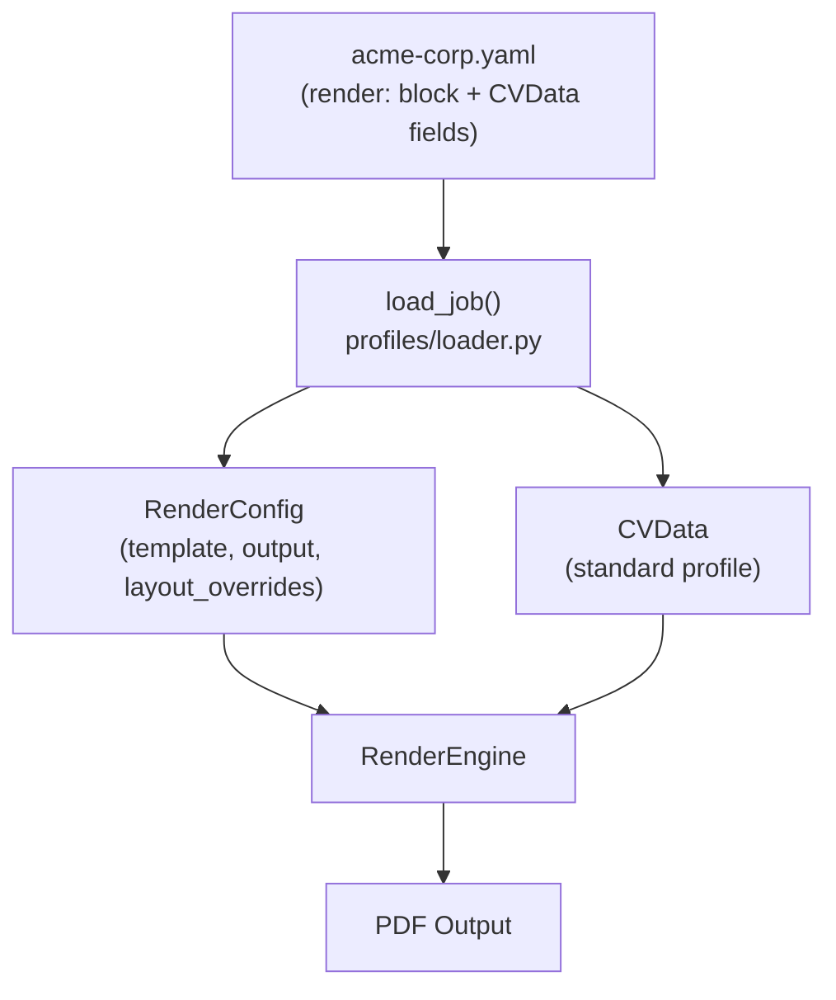

# Job YAML — Per-Application Render Configuration

**Version**: 1.0
**Created**: 2026-05-13
**Author**: Orlando Bruno
**Status**: Proposed
**Area**: cli
**Related Documents**: `ADR-004__sys__profile-schema-design.md`, `ADR-007__tpl__spec-yaml-llm.md`, `ADR-010__cli__template-dir-resolution.md`

---

## Executive Summary

Users need to save per-job render configuration — template choice, output path, and layout overrides (margins, font size) — alongside CV content adapted for that specific application, in a single versioned file. This ADR defines the Job YAML format: a single file that collapses CV content (standard CVData fields) with a `render:` block containing render configuration. A new `--job` flag on `generate`, `validate`, `preview`, and `estimate` accepts this file. The existing `--profile` flag is unchanged for backward compatibility.

---

## 1. Problem Statement

### Context

Paperwork's current model has one input: a profile YAML with CV content, plus CLI flags for template slug and output path. This works for one-off renders but does not support a job-search workflow where the user:

1. Adapts CV content to fit a specific template's constraints (informed by `paperwork spec`)
2. Applies per-job layout tweaks (e.g., tighter margins to fit one page)
3. Re-renders the same application multiple times as content evolves
4. Maintains a versioned record of exactly what was sent to each employer

### Workflow Context (Informational — Outside CLI Scope)

A typical user maintains a **master CV** — a comprehensive document with all their experience, skills, and history, unconstrained by any template. Before applying to a specific job, they:

1. Run `paperwork spec --template <slug>` to learn the template's field constraints (max chars, max items, layout)
2. Ask an LLM to generate a job-specific profile from the master, trimmed to those constraints
3. Store this adapted profile alongside render configuration as a single job YAML
4. Re-render on demand as the application evolves

Paperwork's responsibility is step 1 (providing the spec via `paperwork spec`) and steps 3–4 (accepting the job YAML and rendering). The master CV and LLM interaction are outside the CLI's scope.

### Desired Outcome

A file format and CLI flag that let users:
- Store CV content + render configuration in a single versioned file per job application
- Override layout parameters (margins, font size) per job without editing `template.yaml`
- Re-render identically from the same file at any time

---

## 2. Architecture Overview



The `render:` key is extracted first; the remaining fields are passed to `CVData` validation as normal. The engine receives a standard `CVData` instance — no changes to the rendering pipeline.

---

## 3. Options Considered

### Option A: Collapsed Job YAML — Chosen

Single file with a `render:` block at root alongside CVData fields:

```yaml
render:
  template: classic
  output: ./cv-acme-corp.pdf
  layout_overrides:
    margin_mm: 14
    font_size_pt: 9.5

name: "Orlando Bruno"
titles:
  - "Data Scientist"
work_experience:
  - position: "Senior Data Engineer"
    company: "Acme Corp"
    years: "2022 – present"
    roles:
      - "Built distributed pipeline processing 1M events/day"
```

**Pros**:
- Single file per job application — trivial to version, share, and re-render
- CVData fields at root level match the existing profile YAML format — no extra nesting for content
- `render:` is unambiguous; no CVData field is or will be named `render`
- `--profile` flag and all existing workflows unchanged

**Cons**:
- `render:` key must be stripped before passing remaining fields to CVData — one extra parsing step
- A raw YAML reader sees a mixed document (config + data)

---

### Option B: Two Separate Files per Job

`acme-corp-profile.yaml` (CVData) + `acme-corp-render.yaml` (render config), both passed to the CLI.

**Pros**:
- Clean separation of content and config — each file independently valid against its schema

**Cons**:
- Two files to manage per job application
- Must pass both paths on every CLI invocation
- Harder to version and track as a unit — commit must include both files to be reproducible

---

### Option C: Extend CVData with a `render` Field

Add `render: RenderConfig` directly to the CVData Pydantic model.

**Pros**:
- Single schema covers everything
- No special parsing step

**Cons**:
- Pollutes the content schema with presentation concerns — violates the ADR-004 contract
- Templates receive render config in their Jinja2 context dict, which is incorrect
- Breaks the HTTP API: `POST /render` accepts CVData as the body; render config belongs in query params, not the body

---

## 4. Chosen Solution

**Decision**: Option A — Collapsed Job YAML with `render:` block.

**Rationale**: A single versioned file per job application is the right UX for the target workflow. Option A achieves this without polluting the CVData schema (Option C) or requiring two files (Option B). The `render:` key is unambiguous — no CVData field is named `render` — so splitting the document is a trivial one-key extraction. The existing `--profile` flag and CVData schema are unchanged; the job YAML is an additive path.

---

## 5. Implementation Specification

### New Model: RenderConfig

```python
# src/paperwork/models/render_config.py

from pydantic import BaseModel
from typing import Optional

class LayoutOverrides(BaseModel):
    margin_mm: Optional[float] = None
    font_size_pt: Optional[float] = None
    line_height: Optional[float] = None

class RenderConfig(BaseModel):
    template: str
    output: str
    layout_overrides: LayoutOverrides = LayoutOverrides()
    auto_fit: bool = False
    target_pages: int = 1
```

### Loader Extension: load_job()

```python
# src/paperwork/profiles/loader.py

def load_job(path: Path) -> tuple[CVData, RenderConfig]:
    """Parse a job YAML into CVData + RenderConfig.

    Extracts the top-level 'render:' key for RenderConfig,
    then validates remaining fields as CVData.
    """
    raw = yaml.safe_load(path.read_text())
    render_raw = raw.pop("render", {})
    render_config = RenderConfig.model_validate(render_raw)
    cv_data = CVData.model_validate(raw)
    return cv_data, render_config
```

### CLI Changes

`--job` flag added to `generate`, `validate`, `preview`, `estimate`. Mutually exclusive with `--profile` on `generate` (where `--template` and `--output` would otherwise be required):

```
paperwork generate --job jobs/acme-corp.yaml
paperwork validate --job jobs/acme-corp.yaml
paperwork preview  --job jobs/acme-corp.yaml
paperwork estimate --job jobs/acme-corp.yaml
```

When `--job` is provided to `generate`, `--template` and `--output` are read from the `render:` block. Providing both `--job` and `--profile` (or `--template`/`--output`) is an error (exit code 2).

### Layout Overrides Application

`layout_overrides` values are injected as CSS custom property overrides prepended to the template stylesheet:

```css
/* injected by engine from layout_overrides */
:root {
  --margin-mm: 14mm;
  --font-size-pt: 9.5pt;
}
```

Templates consume these via CSS variables (e.g., `margin: var(--margin-mm, 20mm)`). Templates that do not reference these variables ignore the overrides silently. Template authors document supported override variables in `spec.yaml` under a `layout_overrides` section.

---

## 6. Performance & Cost

| Concern | Impact | Notes |
|---------|--------|-------|
| `render:` key extraction from raw dict | Negligible | Single `dict.pop()` call |
| Extra Pydantic model (RenderConfig) | Negligible | Small model, compiled once at import |
| CSS override injection | Negligible | String prepend before WeasyPrint call |

---

## 7. Risks & Mitigation

| Risk | Impact | Likelihood | Mitigation |
|------|--------|------------|------------|
| `render:` key conflicts with a future CVData field | Low | Low | `render` is not a CV concept; CVData model explicitly excludes it via Pydantic |
| Layout overrides silently ignored by templates not using CSS variables | Medium | Medium | Document in template authoring guide; `paperwork validate --job` warns if template doesn't declare supported override variables in spec.yaml |
| Users put render-config keys at root level (not under `render:`) | Low | Medium | Pydantic raises ValidationError with field name; error message directs user to `render:` block |

---

## 8. Decision Log

| Date | Decision | Rationale |
|------|----------|-----------|
| 2026-05-13 | `render:` block at root, CVData fields at root | No extra nesting for content; `render:` is unambiguous |
| 2026-05-13 | `--job` mutually exclusive with `--profile`/`--template`/`--output` on generate | Prevents ambiguous inputs; job YAML is self-contained |
| 2026-05-13 | Layout overrides as CSS custom properties | No engine changes needed per template; templates opt in by referencing CSS variables |
| 2026-05-13 | Master CV concept documented as informational, not implemented | The CLI's role is to provide spec information for LLM-assisted adaptation; master CV management is the user's concern |

---

## 9. Related Documents

- `ADR-004__sys__profile-schema-design.md` — CVData schema; unchanged by this ADR
- `ADR-007__tpl__spec-yaml-llm.md` — spec.yaml provides constraints that inform content generation before job YAML is authored
- `ADR-010__cli__template-dir-resolution.md` — `--templates-dir` resolution unchanged; applies to `--job` path as well
- `src/paperwork/models/cv.py` — CVData model
- `src/paperwork/profiles/loader.py` — load_job() implementation target

---

**Last Updated**: 2026-05-13 by Orlando Bruno
