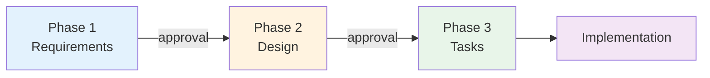

# Specifications

Feature specifications for Paperwork. Each spec follows a 3-phase workflow with approval gates.

## Active Specs

| Feature | Phase | Status | Created |
|---------|-------|--------|---------|
| [additional-template-designs](active/additional-template-designs/01_requirements.md) | 3 — Tasks | Active | 2026-05-12 |
| [api-spec-endpoint](active/api-spec-endpoint/01_requirements.md) | 3 — Tasks | Active | 2026-05-12 |
| [test-suite](active/test-suite/01_requirements.md) | 3 — Tasks | Active | 2026-05-12 |

## Archived Specs

| Feature | Completed | Notes |
|---------|-----------|-------|
| — | No archived specs yet | — |

## Spec Workflow



1. **Requirements** (`01_requirements.md`) — What to build, success criteria
2. **Design** (`02_design.md`) — How to build it, architecture
3. **Tasks** (`03_tasks.md`) — Implementation breakdown

## Folder Structure

```
04_Specs/
├── active/
│   └── feature-name/
│       ├── 01_requirements.md
│       ├── 02_design.md
│       └── 03_tasks.md
└── archive/
    └── completed-feature/
        └── ...
```

## When to Create a Spec

- Building a new feature or system
- Requirements are complex enough to warrant documentation
- Multiple phases of work needed
- You want approval gates before committing to implementation

---

Last Updated: 2026-05-12
