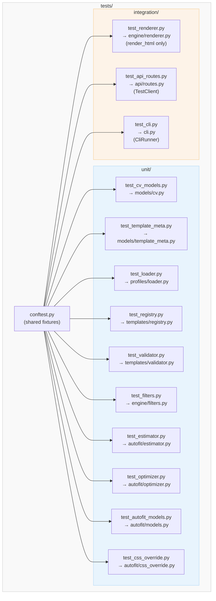

# Test Suite — Design

**Version**: 1.0
**Created**: 2026-05-12
**Author**: Orlando Bruno
**Status**: Draft
**Phase**: 2 of 3 (Design)
**Requirements**: [01_requirements.md](./01_requirements.md)

---

## Design Approaches Considered

| Approach | Description | Pros | Cons | Decision |
|----------|-------------|------|------|----------|
| Mirror `src/` layout | `tests/unit/` mirrors `src/paperwork/` structure exactly; one test file per source module | Easy to navigate, clear ownership, standard Python convention | Slightly more files to create upfront | **Selected** |
| Flat `tests/` | All test files in one directory, named by module | Simple for small codebases | Becomes unnavigable past ~10 test files; mixes unit and integration | Rejected |
| Feature-based grouping | `tests/rendering/`, `tests/fitting/`, `tests/api/` — grouped by user-facing capability | Aligns with acceptance tests | Blurs unit/integration boundaries; harder to identify what covers what module | Rejected for unit layer; partially adopted for integration |
| Single `test_all.py` | One mega-file | Minimal overhead | Untestable at scale; no parallel execution possible | Rejected |

The selected approach uses a two-level hierarchy: `tests/unit/` for per-module pure-function tests and `tests/integration/` for cross-module and external-interaction tests. A single `tests/conftest.py` provides shared fixtures. There is no `tests/e2e/` directory in Phase 1.

---

## Architecture Overview



Test execution layers, innermost to outermost:

- **Unit layer** (`tests/unit/`): Tests one function or class in isolation. External I/O (filesystem, WeasyPrint) is either avoided (pure functions) or handled via `tmp_path` fixtures. No network, no subprocess.
- **Integration layer** (`tests/integration/`): Tests one module's interaction with its real dependencies — `RenderEngine` talking to a real Jinja2 env and a fixture template dir; API routes talking to a real `RenderEngine`; CLI commands talking to a real engine via `CliRunner`. WeasyPrint PDF calls are mocked.
- **Slow layer** (future / marked `@pytest.mark.slow`): Full PDF render via WeasyPrint. Excluded from default `pytest` run. Run manually or on a CI runner with system deps installed.

---

## Components

### `tests/conftest.py`

Shared fixtures available to all test modules. Provides: `sample_cv_data`, `sample_cv_dict`, `sample_layout_params`, `fixture_templates_dir`, `sample_profile_yaml`, `sample_profile_json`, `render_engine`.

### `tests/unit/test_cv_models.py`

Tests: `CVData`, `ContactInfo`, `Education`, `WorkExperience`, `CompetencyGroup`, `Language`, `Certification`. Focus: Pydantic validation, default values, field optionality.

### `tests/unit/test_template_meta.py`

Tests: `TemplateMeta`, `get_layout_params()`. Focus: `layout_params=None` raises `ValueError`, `layout_params` dict is correctly parsed into `LayoutParams`.

### `tests/unit/test_loader.py`

Tests: `load_profile()` with YAML, JSON, missing file, bad YAML, bad JSON, unsupported extension, schema violation. Uses `tmp_path` for file I/O.

### `tests/unit/test_registry.py`

Tests: `TemplateRegistry._scan()`, `list_templates()`, `get_template()`, `get_template_dir()`, `TemplateNotFoundError`. Uses `fixture_templates_dir` (a `tmp_path`-based minimal template directory).

### `tests/unit/test_validator.py`

Tests: `validate_profile_for_template()` and `_resolve_field()`. Parameterized across: all required present, one required missing, empty list treated as missing, `None` treated as missing, optional fields classified correctly. Uses `ValidationResult.format_errors()` and `format_report()`.

### `tests/unit/test_filters.py`

Tests: `base_url_filter()` for full URLs, URLs with query params, scheme-less URLs, paths only. Tests `register_filters()` attaches filter to env.

### `tests/unit/test_estimator.py`

Tests: `estimate_all()`, `total_lines()`, `estimate_section()`, and all five `_estimate_*` private helpers. Parameterized for different `LayoutParams` values. Validates numeric formulas directly (e.g., `math.ceil(len(text) / cpl) + heading_lines`).

### `tests/unit/test_optimizer.py`

Tests: `optimize()` end-to-end (no WeasyPrint — pure dict operations), `_phase_margins()`, `_phase_trim()`, `_apply_trim()`, `_trim_remove_items()`, `_trim_bullets_then_entries()`, `_trim_truncate_words()`. Validates immutability (input dict unchanged after call).

### `tests/unit/test_autofit_models.py`

Tests: `LayoutParams.available_lines()` numeric correctness, `LayoutParams.chars_for_margin()` proportional scaling, `TrimRule.from_dict()` for each `TrimStrategy` variant, `LayoutParams.from_dict()` with and without `trim_rules`, `FitReport.format()` output contains expected strings.

### `tests/unit/test_css_override.py`

Tests: `margin_override(25.0)` returns `"@page { margin: 25.0mm; }"`, `margin_override(12.5)` formats correctly.

### `tests/integration/test_renderer.py`

Tests: `RenderEngine(fixture_templates_dir)` constructs without error, `render_html()` returns non-empty string containing CV name, `render_html()` raises `ValidationError` when required fields are missing, `validate()` returns correct `ValidationResult`. All via `fixture_templates_dir` fixture. No WeasyPrint calls.

### `tests/integration/test_api_routes.py`

Tests all six route handlers via FastAPI `TestClient`. Engine and profiles dir provided via fixtures. Uses `monkeypatch` to mock `render_pdf()` → returns `b"PDF"` to avoid WeasyPrint.

### `tests/integration/test_cli.py`

Tests all five CLI commands via Click `CliRunner`. Uses `fixture_templates_dir` and `sample_profile_yaml`. Mocks `engine.render_pdf()` for the `generate` command.

---

## Data Model / Test Fixtures

All fixtures live in `tests/conftest.py`. Scope is `function` unless noted.

### `sample_cv_data` → `CVData`

```python
@pytest.fixture
def sample_cv_data() -> CVData:
    return CVData(
        name="Jane Doe",
        titles=["Data Engineer", "Python Developer"],
        profile="Experienced engineer focused on data pipelines.",
        contact_info=ContactInfo(
            email="jane@example.com",
            phone="+1-555-0100",
            location="San Francisco, CA",
            linkedin="linkedin.com/in/janedoe",
            github="github.com/janedoe",
        ),
        education=[
            Education(
                degree="BSc Computer Science",
                institution="State University",
                year="2018",
                location="California",
            )
        ],
        work_experience=[
            WorkExperience(
                position="Data Engineer",
                company="Acme Corp",
                years="2020–2024",
                roles=["Built ETL pipelines.", "Reduced query latency by 40%."],
            )
        ],
        competencies_and_skills=[
            CompetencyGroup(
                competency="Programming",
                skills=["Python", "SQL", "dbt"],
            )
        ],
        languages=[Language(language="English", level="Native")],
        certifications=[
            Certification(name="AWS SAA", issuer="Amazon", year="2022")
        ],
    )
```

### `sample_cv_dict` → `dict`

```python
@pytest.fixture
def sample_cv_dict(sample_cv_data) -> dict:
    return sample_cv_data.model_dump()
```

### `sample_layout_params` → `LayoutParams`

```python
@pytest.fixture
def sample_layout_params() -> LayoutParams:
    return LayoutParams()  # default values
```

### `fixture_templates_dir` → `Path` (scope: `session`)

Creates a minimal template directory in `tmp_path_factory` that mirrors the real `templates/classic/` structure. The `template.yaml` declares zero required fields so all tests pass without a full profile.

```python
@pytest.fixture(scope="session")
def fixture_templates_dir(tmp_path_factory) -> Path:
    base = tmp_path_factory.mktemp("templates")
    classic = base / "classic"
    classic.mkdir()

    (classic / "template.yaml").write_text(
        "name: Classic Test\n"
        "slug: classic\n"
        "version: 0.0.1\n"
        "html_file: cv.html\n"
        "css_file: cv.css\n"
        "required_fields: []\n"
        "optional_fields: [name, profile]\n"
    )
    (classic / "cv.html").write_text(
        "<!DOCTYPE html><html><body>"
        "<h1>{{ name }}</h1>"
        "<p>{{ profile }}</p>"
        "</body></html>"
    )
    (classic / "cv.css").write_text("body { font-family: sans-serif; }")

    return base
```

### `sample_profile_yaml` → `Path`

```python
@pytest.fixture
def sample_profile_yaml(tmp_path, sample_cv_data) -> Path:
    path = tmp_path / "profile.yaml"
    import yaml
    path.write_text(yaml.dump(sample_cv_data.model_dump()))
    return path
```

### `sample_profile_json` → `Path`

```python
@pytest.fixture
def sample_profile_json(tmp_path, sample_cv_data) -> Path:
    path = tmp_path / "profile.json"
    import json
    path.write_text(json.dumps(sample_cv_data.model_dump()))
    return path
```

### `render_engine` → `RenderEngine`

```python
@pytest.fixture
def render_engine(fixture_templates_dir) -> RenderEngine:
    return RenderEngine(fixture_templates_dir)
```

---

## API Design (Test Structure)

### File naming

All test files begin with `test_` (pytest discovery default). Named after the source module they primarily test:

```
tests/unit/test_cv_models.py        → src/paperwork/models/cv.py
tests/unit/test_template_meta.py    → src/paperwork/models/template_meta.py
tests/unit/test_loader.py           → src/paperwork/profiles/loader.py
tests/unit/test_registry.py         → src/paperwork/templates/registry.py
tests/unit/test_validator.py        → src/paperwork/templates/validator.py
tests/unit/test_filters.py          → src/paperwork/engine/filters.py
tests/unit/test_estimator.py        → src/paperwork/autofit/estimator.py
tests/unit/test_optimizer.py        → src/paperwork/autofit/optimizer.py
tests/unit/test_autofit_models.py   → src/paperwork/autofit/models.py
tests/unit/test_css_override.py     → src/paperwork/autofit/css_override.py
tests/integration/test_renderer.py  → src/paperwork/engine/renderer.py
tests/integration/test_api_routes.py → src/paperwork/api/routes.py
tests/integration/test_cli.py       → src/paperwork/cli.py
```

### Function naming

Pattern: `test_<function_name>_<scenario>`. Examples:
- `test_load_profile_valid_yaml`
- `test_load_profile_missing_file_raises_profile_load_error`
- `test_estimate_all_returns_header_entry`
- `test_validate_profile_required_field_missing_sets_is_valid_false`

### Parameterization

Use `@pytest.mark.parametrize` for:
- `base_url_filter` — multiple URL inputs/outputs
- `validate_profile_for_template` — required/optional field scenarios
- `_resolve_field` — dotted-path cases (nested, empty, None)
- `TrimRule.from_dict` — each `TrimStrategy` variant
- `margin_override` — multiple float inputs

### Fixture scope

- `session`: `fixture_templates_dir` (expensive directory creation, reused across all tests)
- `function` (default): everything else (ensures test isolation)

### Markers

```ini
# pyproject.toml [tool.pytest.ini_options]
markers = [
    "slow: marks tests requiring WeasyPrint system libs (deselect with -m 'not slow')",
]
```

---

## pytest Configuration

The full `[tool.pytest.ini_options]` block to add to `pyproject.toml`:

```toml
[tool.pytest.ini_options]
testpaths = ["tests"]
pythonpath = ["src"]
addopts = [
    "--cov=src/paperwork",
    "--cov-report=term-missing",
    "--cov-fail-under=80",
    "-m", "not slow",
]
markers = [
    "slow: marks tests requiring WeasyPrint system libs (deselect with -m 'not slow')",
]
```

- `testpaths`: Restricts discovery to `tests/` — prevents pytest from scanning `src/` or the project root.
- `addopts`: Coverage flags run automatically on every `uv run pytest` invocation. `--cov-fail-under=80` causes a non-zero exit when total coverage drops below 80%.
- `-m "not slow"`: Excludes `@pytest.mark.slow` tests from the default run. CI does not need WeasyPrint system libraries.
- Developers run `uv run pytest -m slow` to execute the full PDF render tests locally.

---

## Error Handling in Tests

**Asserting exceptions**: Use `pytest.raises()` as a context manager with `match=` to verify error message content:

```python
with pytest.raises(ProfileLoadError, match="Profile not found"):
    load_profile(Path("/nonexistent/profile.yaml"))
```

**Asserting validation failure**: Check `result.is_valid` is `False` and `result.missing_required` contains the expected field path:

```python
result = validate_profile_for_template(cv_data, meta)
assert result.is_valid is False
assert "name" in result.missing_required
```

**Asserting HTTP error responses**: Use `TestClient` response status code:

```python
response = client.post("/render", json={}, params={"template": "nonexistent"})
assert response.status_code == 404
```

**Asserting CLI non-zero exit**: Use `CliRunner.invoke()` and check `result.exit_code`:

```python
result = runner.invoke(cli, ["validate", "-p", str(bad_profile), "-t", "classic"])
assert result.exit_code == 1
```

---

## Technology Choices

| Tool | Purpose | Rationale |
|------|---------|-----------|
| `pytest>=8.0` | Test runner | Already declared in dev dependencies; standard Python testing tool |
| `pytest-cov>=5.0` | Coverage | Integrates cleanly with `pytest` via `--cov` flag; produces term-missing report |
| `httpx>=0.27` | FastAPI TestClient transport | Required by `fastapi.testclient.TestClient` in modern FastAPI; not bundled |
| `click.testing.CliRunner` | CLI testing | Built into Click; no additional dependency; captures stdout/stderr |
| `fastapi.testclient.TestClient` | API integration tests | Runs routes in-process without a real server; synchronous interface |
| `unittest.mock.patch` / `pytest` `monkeypatch` | Mocking WeasyPrint | Prevents system library dependency in CI; patches `weasyprint.HTML` |
| `tmp_path` / `tmp_path_factory` | Temporary files | Built-in pytest fixtures; clean per-test isolation |
| Pydantic v2 `model_dump()` | Fixture serialization | Consistent with production code; no v1 `.dict()` shims |

`pytest-asyncio` is not needed: FastAPI `TestClient` is synchronous; the routes are synchronous functions.

---

## Related Documents

- Requirements: [01_requirements.md](./01_requirements.md)
- Tasks: [03_tasks.md](./03_tasks.md)
- PRD: `../../01_PRD/prd.md`
- Source tree: `src/paperwork/`

---

## Change Log

| Date | Version | Author | Change |
|------|---------|--------|--------|
| 2026-05-12 | 1.0 | Orlando Bruno | Initial draft |

**Last Updated**: 2026-05-12
