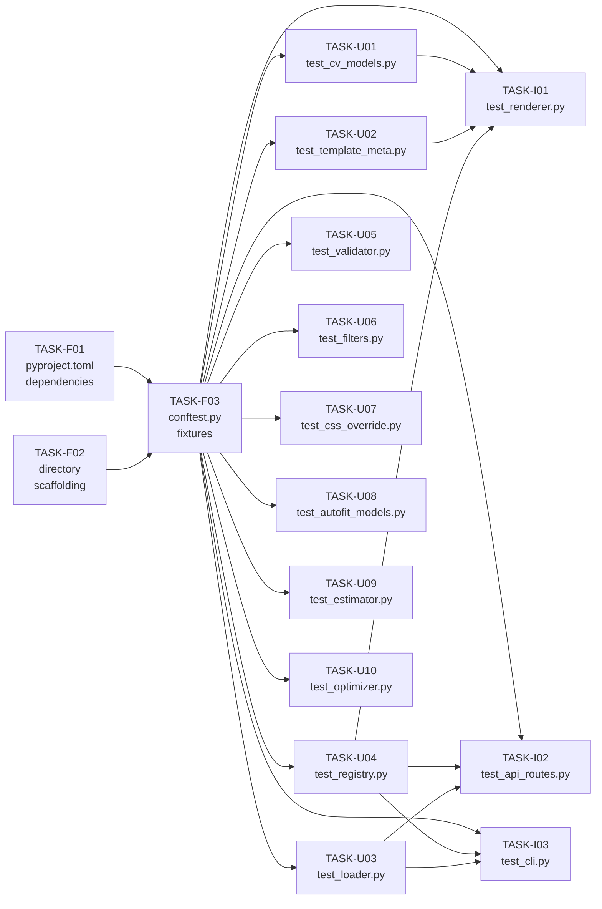

# Test Suite — Tasks

**Version**: 1.0
**Created**: 2026-05-12
**Author**: Orlando Bruno
**Status**: Draft
**Phase**: 3 of 3 (Tasks)

---

## What We're NOT Doing

- No end-to-end PDF visual tests — `render_pdf()` via WeasyPrint is mocked or skipped in all CI-facing tests. Manual verification of PDF output is out of scope.
- No pixel-level or visual regression tests for rendered HTML/PDF output.
- No load or performance benchmarks — the 60-second suite runtime is an internal constraint, not a benchmark target.
- No Windows CI — Windows is not a supported platform per PRD §3.
- No browser automation (Playwright, Selenium) — HTML output is tested as a string.
- No W3C validation of `cv.html` template files.
- No tests for the SCSS→CSS compilation pipeline.
- No mutation testing.

---

## Task Breakdown

### Phase 1: Foundation

**Goal**: Establish the test infrastructure so subsequent phases can run immediately.

---

#### TASK-F01: Add `pytest-cov` and `httpx` to `pyproject.toml`

File: `/Users/orlandobruno/Documents/Areas/Software-Dev/CLI-Tools/paperwork-cli/pyproject.toml`

Edit the `[project.optional-dependencies]` `dev` section:

```toml
[project.optional-dependencies]
dev = [
    "pytest>=8.0",
    "pytest-cov>=5.0",
    "httpx>=0.27",
    "ruff>=0.5.0",
]
```

Also add pytest configuration for markers and coverage defaults:

```toml
[tool.pytest.ini_options]
pythonpath = ["src"]
markers = [
    "slow: marks tests requiring WeasyPrint system libs (deselect with -m 'not slow')",
]
```

After editing, run: `uv sync --extra dev`

---

#### TASK-F02: Create `tests/` directory structure

Create the following empty files to establish the package structure:

```
tests/__init__.py
tests/conftest.py              ← fixtures (see TASK-F03)
tests/unit/__init__.py
tests/unit/test_cv_models.py
tests/unit/test_template_meta.py
tests/unit/test_loader.py
tests/unit/test_registry.py
tests/unit/test_validator.py
tests/unit/test_filters.py
tests/unit/test_estimator.py
tests/unit/test_optimizer.py
tests/unit/test_autofit_models.py
tests/unit/test_css_override.py
tests/integration/__init__.py
tests/integration/test_renderer.py
tests/integration/test_api_routes.py
tests/integration/test_cli.py
```

All files should begin with a module docstring describing what they test.

---

#### TASK-F03: Write `tests/conftest.py`

File: `/Users/orlandobruno/Documents/Areas/Software-Dev/CLI-Tools/paperwork-cli/tests/conftest.py`

Implement all six shared fixtures from the design spec:

- `sample_cv_data` — full `CVData` instance (Jane Doe, with education, work, skills, certs)
- `sample_cv_dict` — `sample_cv_data.model_dump()`
- `sample_layout_params` — `LayoutParams()` with defaults
- `fixture_templates_dir` (scope: `session`) — `tmp_path_factory` directory with `classic/` subdirectory containing minimal `template.yaml`, `cv.html`, and `cv.css`
- `sample_profile_yaml` — `tmp_path / "profile.yaml"` written from `sample_cv_data`
- `sample_profile_json` — `tmp_path / "profile.json"` written from `sample_cv_data`
- `render_engine` — `RenderEngine(fixture_templates_dir)`

The `fixture_templates_dir`'s `template.yaml` must declare `required_fields: []` so all integration tests can render without validation errors.

Verification: `uv run pytest tests/conftest.py --collect-only` should show 0 errors (fixtures are not collected as tests but conftest loads cleanly).

---

### Phase 2: Unit Tests

**Goal**: Cover all pure functions and Pydantic models. These tests have no external dependencies beyond `tmp_path` for file I/O.

---

#### TASK-U01: `tests/unit/test_cv_models.py`

Source: `src/paperwork/models/cv.py`

Tests to write:

```python
def test_cv_data_minimal():
    """CVData requires only 'name'."""
    cv = CVData(name="Alice")
    assert cv.name == "Alice"
    assert cv.education == []
    assert cv.contact_info == ContactInfo()

def test_cv_data_full(sample_cv_data):
    """CVData with all fields populates nested models."""
    assert sample_cv_data.name == "Jane Doe"
    assert len(sample_cv_data.education) == 1
    assert sample_cv_data.education[0].degree == "BSc Computer Science"

def test_contact_info_all_optional():
    """ContactInfo can be instantiated with no fields."""
    c = ContactInfo()
    assert c.email is None
    assert c.phone is None

def test_education_required_fields():
    """Education requires degree, institution, year."""
    with pytest.raises(ValidationError):
        Education(degree="BSc")  # missing institution, year

def test_work_experience_roles_default_empty():
    """WorkExperience.roles defaults to empty list."""
    w = WorkExperience(position="Dev", company="Co", years="2020–2024")
    assert w.roles == []

def test_competency_group_requires_skills_list():
    """CompetencyGroup.skills must be a list."""
    cg = CompetencyGroup(competency="Programming", skills=["Python"])
    assert cg.skills == ["Python"]

def test_language_fields():
    lang = Language(language="Spanish", level="B2")
    assert lang.level == "B2"

def test_certification_all_required():
    with pytest.raises(ValidationError):
        Certification(name="AWS SAA")  # missing issuer, year
```

---

#### TASK-U02: `tests/unit/test_template_meta.py`

Source: `src/paperwork/models/template_meta.py`

```python
def test_template_meta_defaults():
    meta = TemplateMeta(name="Classic", slug="classic", version="1.0.0")
    assert meta.html_file == "cv.html"
    assert meta.css_file == "cv.css"
    assert meta.supports_photo is True
    assert meta.required_fields == []

def test_get_layout_params_raises_when_none():
    meta = TemplateMeta(name="X", slug="x", version="1.0")
    with pytest.raises(ValueError, match="no layout_params"):
        meta.get_layout_params()

def test_get_layout_params_parses_dict():
    meta = TemplateMeta(
        name="X", slug="x", version="1.0",
        layout_params={"chars_per_line": 80, "margin_max_mm": 20},
    )
    lp = meta.get_layout_params()
    assert lp.chars_per_line == 80
    assert lp.margin_max_mm == 20
```

---

#### TASK-U03: `tests/unit/test_loader.py`

Source: `src/paperwork/profiles/loader.py`

```python
def test_load_profile_valid_yaml(sample_profile_yaml):
    cv = load_profile(sample_profile_yaml)
    assert cv.name == "Jane Doe"

def test_load_profile_valid_json(sample_profile_json):
    cv = load_profile(sample_profile_json)
    assert cv.name == "Jane Doe"

def test_load_profile_missing_file_raises():
    with pytest.raises(ProfileLoadError, match="Profile not found"):
        load_profile(Path("/nonexistent/profile.yaml"))

def test_load_profile_malformed_yaml(tmp_path):
    bad = tmp_path / "bad.yaml"
    bad.write_text("name: [unclosed")
    with pytest.raises(ProfileLoadError, match="Failed to parse"):
        load_profile(bad)

def test_load_profile_malformed_json(tmp_path):
    bad = tmp_path / "bad.json"
    bad.write_text("{name: missing-quotes}")
    with pytest.raises(ProfileLoadError, match="Failed to parse"):
        load_profile(bad)

def test_load_profile_unsupported_extension(tmp_path):
    bad = tmp_path / "profile.toml"
    bad.write_text("name = 'Alice'")
    with pytest.raises(ProfileLoadError, match="Unsupported format"):
        load_profile(bad)

def test_load_profile_schema_violation(tmp_path):
    """YAML with no 'name' field fails CVData validation."""
    bad = tmp_path / "bad_schema.yaml"
    bad.write_text("education: []")
    with pytest.raises(ProfileLoadError, match="Profile validation failed"):
        load_profile(bad)

def test_load_profile_top_level_not_dict(tmp_path):
    """YAML that is a list, not a mapping, raises ProfileLoadError."""
    bad = tmp_path / "list.yaml"
    bad.write_text("- item1\n- item2\n")
    with pytest.raises(ProfileLoadError, match="Expected a mapping"):
        load_profile(bad)
```

---

#### TASK-U04: `tests/unit/test_registry.py`

Source: `src/paperwork/templates/registry.py`

```python
def test_registry_discovers_classic_template(fixture_templates_dir):
    reg = TemplateRegistry(fixture_templates_dir)
    templates = reg.list_templates()
    assert len(templates) == 1
    assert templates[0].slug == "classic"

def test_registry_empty_dir(tmp_path):
    reg = TemplateRegistry(tmp_path)
    assert reg.list_templates() == []

def test_registry_skips_underscore_dirs(tmp_path):
    """Directories starting with '_' are skipped."""
    (tmp_path / "_private").mkdir()
    (tmp_path / "_private" / "template.yaml").write_text(
        "name: Private\nslug: private\nversion: 1.0\n"
    )
    reg = TemplateRegistry(tmp_path)
    assert reg.list_templates() == []

def test_get_template_known_slug(fixture_templates_dir):
    reg = TemplateRegistry(fixture_templates_dir)
    meta = reg.get_template("classic")
    assert meta.name == "Classic Test"

def test_get_template_unknown_slug_raises(fixture_templates_dir):
    reg = TemplateRegistry(fixture_templates_dir)
    with pytest.raises(TemplateNotFoundError, match="'modern' not found"):
        reg.get_template("modern")

def test_get_template_dir_returns_path(fixture_templates_dir):
    reg = TemplateRegistry(fixture_templates_dir)
    path = reg.get_template_dir("classic")
    assert path == fixture_templates_dir / "classic"
    assert path.is_dir()

def test_registry_nonexistent_dir(tmp_path):
    """TemplateRegistry does not raise when directory doesn't exist; returns empty."""
    reg = TemplateRegistry(tmp_path / "no_such_dir")
    assert reg.list_templates() == []
```

---

#### TASK-U05: `tests/unit/test_validator.py`

Source: `src/paperwork/templates/validator.py`

```python
@pytest.fixture
def meta_with_required():
    return TemplateMeta(
        name="T", slug="t", version="1.0",
        required_fields=["name", "contact_info.email"],
        optional_fields=["profile", "education"],
    )

def test_valid_when_all_required_present(sample_cv_data, meta_with_required):
    result = validate_profile_for_template(sample_cv_data, meta_with_required)
    assert result.is_valid is True
    assert "name" in result.present_required
    assert "contact_info.email" in result.present_required

def test_invalid_when_required_missing():
    cv = CVData(name="Alice")  # no contact_info.email
    meta = TemplateMeta(
        name="T", slug="t", version="1.0",
        required_fields=["contact_info.email"],
    )
    result = validate_profile_for_template(cv, meta)
    assert result.is_valid is False
    assert "contact_info.email" in result.missing_required

def test_empty_list_field_treated_as_missing(sample_cv_data):
    cv = CVData(name="Alice", education=[])  # explicitly empty
    meta = TemplateMeta(
        name="T", slug="t", version="1.0",
        required_fields=["education"],
    )
    result = validate_profile_for_template(cv, meta)
    assert result.is_valid is False

def test_optional_absent_reported_in_missing_optional():
    cv = CVData(name="Alice")
    meta = TemplateMeta(
        name="T", slug="t", version="1.0",
        optional_fields=["profile"],
    )
    result = validate_profile_for_template(cv, meta)
    assert result.is_valid is True  # optional missing doesn't fail
    assert "profile" in result.missing_optional

def test_format_errors_empty_when_valid(sample_cv_data, meta_with_required):
    result = validate_profile_for_template(sample_cv_data, meta_with_required)
    assert result.format_errors() == ""

def test_format_errors_lists_missing_fields():
    cv = CVData(name="Alice")
    meta = TemplateMeta(
        name="T", slug="t", version="1.0",
        required_fields=["contact_info.email"],
    )
    result = validate_profile_for_template(cv, meta)
    errors = result.format_errors()
    assert "contact_info.email" in errors

@pytest.mark.parametrize("path,expected_found", [
    ("name", True),
    ("contact_info.email", True),
    ("contact_info.nonexistent", False),
    ("nonexistent_field", False),
    ("education", False),          # empty list → not found
])
def test_resolve_field_scenarios(path, expected_found):
    cv = CVData(name="Alice", contact_info=ContactInfo(email="a@b.com"))
    data = cv.model_dump()
    from paperwork.templates.validator import _resolve_field
    found, _ = _resolve_field(data, path)
    assert found is expected_found
```

---

#### TASK-U06: `tests/unit/test_filters.py`

Source: `src/paperwork/engine/filters.py`

```python
@pytest.mark.parametrize("url,expected", [
    ("https://github.com/janedoe?tab=repos", "https://github.com/janedoe"),
    ("https://example.com/path/to/page", "https://example.com/path/to/page"),
    ("https://example.com/", "https://example.com"),
    ("github.com/janedoe", "github.com/janedoe"),
    ("linkedin.com/in/jane?ref=share", "linkedin.com/in/jane"),
])
def test_base_url_filter(url, expected):
    assert base_url_filter(url) == expected

def test_register_filters_attaches_base_url():
    env = Environment()
    register_filters(env)
    assert "base_url" in env.filters
    assert env.filters["base_url"]("https://example.com/path") == "https://example.com/path"
```

---

#### TASK-U07: `tests/unit/test_css_override.py`

Source: `src/paperwork/autofit/css_override.py`

```python
def test_margin_override_integer_value():
    result = margin_override(25.0)
    assert result == "@page { margin: 25.0mm; }"

def test_margin_override_decimal_value():
    result = margin_override(12.5)
    assert result == "@page { margin: 12.5mm; }"

def test_margin_override_min_value():
    result = margin_override(0.0)
    assert result == "@page { margin: 0.0mm; }"
```

---

#### TASK-U08: `tests/unit/test_autofit_models.py`

Source: `src/paperwork/autofit/models.py`

```python
def test_layout_params_available_lines_default():
    """Default LayoutParams gives a reasonable line count per page."""
    params = LayoutParams()
    lines = params.available_lines(params.margin_max_mm)
    # 297mm page, 25mm margins, 10px font at 1.35 line-height ≈ 62 lines * 0.95 safety
    assert 50 < lines < 80

def test_layout_params_available_lines_smaller_margin_gives_more_lines():
    params = LayoutParams()
    lines_at_max = params.available_lines(params.margin_max_mm)
    lines_at_min = params.available_lines(params.margin_min_mm)
    assert lines_at_min > lines_at_max

def test_chars_for_margin_smaller_margin_fewer_chars():
    params = LayoutParams()
    cpl_at_max = params.chars_for_margin(params.margin_max_mm)
    cpl_at_min = params.chars_for_margin(params.margin_min_mm)
    assert cpl_at_min > cpl_at_max  # smaller margin → wider printable area

def test_chars_for_margin_at_max_equals_default():
    params = LayoutParams()
    assert params.chars_for_margin(params.margin_max_mm) == params.chars_per_line

@pytest.mark.parametrize("strategy", list(TrimStrategy))
def test_trim_rule_from_dict_all_strategies(strategy):
    raw = {"field": "work_experience", "strategy": strategy.value}
    rule = TrimRule.from_dict(raw)
    assert rule.strategy == strategy
    assert rule.min_items == 0
    assert rule.min_bullets == 0

def test_layout_params_from_dict_with_trim_rules():
    raw = {
        "chars_per_line": 80,
        "trim_rules": [
            {"field": "work_experience", "strategy": "remove_bullets_then_entries",
             "min_items": 1, "min_bullets": 1},
        ],
    }
    params = LayoutParams.from_dict(raw)
    assert params.chars_per_line == 80
    assert len(params.trim_rules) == 1
    assert params.trim_rules[0].field == "work_experience"

def test_fit_report_format_contains_status():
    report = FitReport(
        target_lines=60.0, original_lines=75.0, final_lines=58.0,
        final_margin_mm=18.0, fits=True, actions=["Margins: 25mm -> 18mm"],
    )
    text = report.format()
    assert "FITS" in text
    assert "Margins: 25mm -> 18mm" in text
```

---

#### TASK-U09: `tests/unit/test_estimator.py`

Source: `src/paperwork/autofit/estimator.py`

```python
def test_total_lines_sums_all_estimates():
    from paperwork.autofit.models import LineEstimate
    estimates = [
        LineEstimate(field="header", lines=5.0),
        LineEstimate(field="profile", lines=3.0),
    ]
    assert total_lines(estimates) == 8.0

def test_estimate_all_includes_header(sample_cv_dict, sample_layout_params):
    estimates = estimate_all(sample_cv_dict, sample_layout_params)
    fields = [e.field for e in estimates]
    assert "header" in fields
    header = next(e for e in estimates if e.field == "header")
    assert header.lines == sample_layout_params.header_fixed_lines

def test_estimate_all_includes_section_gaps(sample_cv_dict, sample_layout_params):
    """Multiple non-empty sections should add a section_gaps entry."""
    estimates = estimate_all(sample_cv_dict, sample_layout_params)
    fields = [e.field for e in estimates]
    assert "section_gaps" in fields

def test_estimate_all_empty_cv():
    """CV with only name (no sections) has no section_gaps."""
    cv = CVData(name="Empty").model_dump()
    params = LayoutParams()
    estimates = estimate_all(cv, params)
    fields = [e.field for e in estimates]
    assert "section_gaps" not in fields

def test_estimate_section_text_field(sample_layout_params):
    import math
    text = "A" * 200
    est = estimate_section("profile", text, sample_layout_params)
    expected_text_lines = math.ceil(200 / sample_layout_params.chars_per_line)
    expected_total = sample_layout_params.section_heading_lines + expected_text_lines
    assert est.lines == expected_total

def test_estimate_section_empty_returns_zero(sample_layout_params):
    est = estimate_section("profile", "", sample_layout_params)
    assert est.lines == 0

def test_estimate_section_none_returns_zero(sample_layout_params):
    est = estimate_section("profile", None, sample_layout_params)
    assert est.lines == 0

def test_estimate_section_work_experience(sample_cv_dict, sample_layout_params):
    """Work experience with roles should yield > heading_lines."""
    est = estimate_section(
        "work_experience",
        sample_cv_dict["work_experience"],
        sample_layout_params,
    )
    assert est.lines > sample_layout_params.section_heading_lines

def test_estimate_all_total_positive(sample_cv_dict, sample_layout_params):
    estimates = estimate_all(sample_cv_dict, sample_layout_params)
    assert total_lines(estimates) > 0
```

---

#### TASK-U10: `tests/unit/test_optimizer.py`

Source: `src/paperwork/autofit/optimizer.py`

```python
def test_optimize_noop_when_fits(sample_cv_dict, sample_layout_params):
    """When CV fits in 2 pages, no trimming should occur."""
    config = FitConfig(target_pages=2, layout=sample_layout_params)
    result = optimize(sample_cv_dict, config)
    assert result.report.fits is True
    assert len(result.report.actions) == 0

def test_optimize_returns_fit_result_type(sample_cv_dict, sample_layout_params):
    config = FitConfig(target_pages=1, layout=sample_layout_params)
    result = optimize(sample_cv_dict, config)
    assert isinstance(result, FitResult)
    assert isinstance(result.report, FitReport)

def test_optimize_does_not_mutate_input(sample_cv_dict, sample_layout_params):
    original_name = sample_cv_dict["name"]
    config = FitConfig(target_pages=1, layout=sample_layout_params)
    optimize(sample_cv_dict, config)
    assert sample_cv_dict["name"] == original_name

def test_phase_margins_reduces_margin_when_overflow():
    """_phase_margins should reduce margin when content overflows."""
    params = LayoutParams(margin_max_mm=25, margin_min_mm=12, margin_step_mm=1)
    # Create a large CV dict with lots of content
    cv = CVData(
        name="Alice",
        profile="X" * 5000,  # Very long profile to force overflow
    ).model_dump()
    margin, target_lines, actions, css = _phase_margins(cv, params, 1)
    # Either margin was reduced or content fits
    assert margin <= params.margin_max_mm

def test_trim_remove_items_reduces_list():
    rule = TrimRule(
        field="education",
        strategy=TrimStrategy.REMOVE_ITEMS_FROM_END,
        min_items=1,
    )
    items = [{"a": 1}, {"b": 2}, {"c": 3}]
    new_items, action = _trim_remove_items(rule, items)
    assert len(new_items) == 2
    assert "education" in action

def test_trim_remove_items_respects_min_items():
    rule = TrimRule(
        field="certifications",
        strategy=TrimStrategy.REMOVE_ITEMS_FROM_END,
        min_items=2,
    )
    items = [{"a": 1}, {"b": 2}]
    new_items, action = _trim_remove_items(rule, items)
    assert len(new_items) == 2  # no change
    assert action == ""

def test_trim_bullets_then_entries_reduces_max_bullets():
    rule = TrimRule(
        field="work_experience",
        strategy=TrimStrategy.REMOVE_BULLETS_THEN_ENTRIES,
        min_items=1,
        min_bullets=1,
    )
    entries = [
        {"position": "Dev", "company": "A", "years": "20", "roles": ["r1", "r2", "r3"]},
        {"position": "Eng", "company": "B", "years": "20", "roles": ["s1"]},
    ]
    new_entries, action = _trim_bullets_then_entries(rule, entries)
    # Entry 0 had max bullets (3), should be reduced to 2
    assert len(new_entries[0]["roles"]) == 2
    assert "work_experience" in action

def test_trim_truncate_words_shortens_text():
    rule = TrimRule(
        field="profile",
        strategy=TrimStrategy.TRUNCATE_WORDS,
        min_words=5,
    )
    text = " ".join(f"word{i}" for i in range(50))
    new_text, action = _trim_truncate_words(rule, text, 80)
    assert len(new_text.split()) < 50
    assert new_text.endswith("...")

def test_optimize_css_overrides_when_margin_reduced():
    """When optimizer reduces margin, css_overrides should be non-empty."""
    params = LayoutParams(margin_max_mm=25, margin_min_mm=12, margin_step_mm=1)
    cv = CVData(name="Alice", profile="X" * 10000).model_dump()
    config = FitConfig(target_pages=1, layout=params)
    result = optimize(cv, config)
    # If margin was changed, CSS overrides should contain @page rule
    if result.report.final_margin_mm < 25:
        assert any("@page" in css for css in result.css_overrides)
```

---

### Phase 3: Integration Tests

**Goal**: Test cross-module interactions, FastAPI routes, and CLI commands. All tests must pass in CI without WeasyPrint system libraries.

---

#### TASK-I01: `tests/integration/test_renderer.py`

Source: `src/paperwork/engine/renderer.py`

Tests `render_html()` (Jinja2 only) and `validate()` via a real engine and fixture template.

```python
def test_render_engine_constructs(fixture_templates_dir):
    engine = RenderEngine(fixture_templates_dir)
    assert len(engine.registry.list_templates()) == 1

def test_render_html_returns_string(render_engine, sample_cv_data):
    html = render_engine.render_html(sample_cv_data, "classic", skip_validation=True)
    assert isinstance(html, str)
    assert len(html) > 0

def test_render_html_contains_cv_name(render_engine, sample_cv_data):
    html = render_engine.render_html(sample_cv_data, "classic", skip_validation=True)
    assert "Jane Doe" in html

def test_render_html_raises_validation_error_on_missing_required(fixture_templates_dir):
    """Template with required fields raises ValidationError when missing."""
    # Build a template that requires 'contact_info.email'
    classic = fixture_templates_dir / "strict"
    classic.mkdir(exist_ok=True)
    (classic / "template.yaml").write_text(
        "name: Strict\nslug: strict\nversion: 1.0\n"
        "html_file: cv.html\ncss_file: cv.css\n"
        "required_fields: [contact_info.email]\n"
        "optional_fields: []\n"
    )
    (classic / "cv.html").write_text("<h1>{{ name }}</h1>")
    (classic / "cv.css").write_text("body {}")

    engine = RenderEngine(fixture_templates_dir)
    cv = CVData(name="Alice")  # no email
    with pytest.raises(ValidationError):
        engine.render_html(cv, "strict")

def test_validate_returns_valid_result(render_engine, sample_cv_data):
    result = render_engine.validate(sample_cv_data, "classic")
    assert isinstance(result, ValidationResult)
    assert result.is_valid is True

@pytest.mark.slow
def test_render_pdf_returns_bytes(render_engine, sample_cv_data):
    """Full PDF render — requires WeasyPrint system libs. Skipped in default CI."""
    pdf = render_engine.render_pdf(sample_cv_data, "classic", skip_validation=True)
    assert isinstance(pdf, bytes)
    assert pdf[:4] == b"%PDF"
```

---

#### TASK-I02: `tests/integration/test_api_routes.py`

Source: `src/paperwork/api/routes.py`

Uses FastAPI `TestClient` (via `httpx`). `render_pdf()` is patched to return `b"PDF"` to avoid WeasyPrint.

```python
import pytest
from fastapi.testclient import TestClient
from unittest.mock import patch

from paperwork.api.routes import create_router
from paperwork.engine.renderer import RenderEngine
from fastapi import FastAPI

@pytest.fixture
def api_client(fixture_templates_dir, tmp_path):
    engine = RenderEngine(fixture_templates_dir)
    profiles_dir = tmp_path / "profiles"
    profiles_dir.mkdir()

    app = FastAPI()
    app.include_router(create_router(engine, profiles_dir))
    return TestClient(app), profiles_dir

def test_health_endpoint(api_client):
    client, _ = api_client
    response = client.get("/")
    assert response.status_code == 200
    data = response.json()
    assert data["status"] == "ok"
    assert data["templates"] >= 1

def test_list_templates_endpoint(api_client):
    client, _ = api_client
    response = client.get("/templates")
    assert response.status_code == 200
    templates = response.json()
    assert isinstance(templates, list)
    assert any(t["slug"] == "classic" for t in templates)

def test_render_endpoint_success(api_client, sample_cv_dict):
    client, _ = api_client
    with patch("paperwork.engine.renderer.RenderEngine.render_pdf", return_value=b"PDF"):
        response = client.post("/render?template=classic", json=sample_cv_dict)
    assert response.status_code == 200
    assert response.headers["content-type"] == "application/pdf"

def test_render_endpoint_unknown_template(api_client, sample_cv_dict):
    client, _ = api_client
    with patch("paperwork.engine.renderer.RenderEngine.render_pdf", return_value=b"PDF"):
        response = client.post("/render?template=nonexistent", json=sample_cv_dict)
    assert response.status_code == 404

def test_render_endpoint_invalid_body(api_client):
    client, _ = api_client
    response = client.post("/render?template=classic", json={"bad": "data"})
    assert response.status_code == 422

def test_render_cv_legacy_endpoint(api_client, sample_cv_dict):
    client, _ = api_client
    with patch("paperwork.engine.renderer.RenderEngine.render_pdf", return_value=b"PDF"):
        response = client.post("/render-cv", json=sample_cv_dict)
    assert response.status_code == 200

def test_render_from_profile_not_found(api_client):
    client, _ = api_client
    response = client.get("/render/nonexistent?template=classic")
    assert response.status_code == 404

def test_render_from_profile_success(api_client, sample_cv_dict, tmp_path):
    client, profiles_dir = api_client
    import yaml
    profile_path = profiles_dir / "jane.yaml"
    profile_path.write_text(yaml.dump(sample_cv_dict))

    with patch("paperwork.engine.renderer.RenderEngine.render_pdf", return_value=b"PDF"):
        response = client.get("/render/jane?template=classic")
    assert response.status_code == 200
```

---

#### TASK-I03: `tests/integration/test_cli.py`

Source: `src/paperwork/cli.py`

Uses Click's `CliRunner`. `render_pdf()` is patched for the `generate` command.

```python
from click.testing import CliRunner
from unittest.mock import patch
from paperwork.cli import cli

@pytest.fixture
def runner():
    return CliRunner()

def test_templates_command_lists_classic(runner, fixture_templates_dir):
    result = runner.invoke(
        cli,
        ["--templates-dir", str(fixture_templates_dir), "templates"],
    )
    assert result.exit_code == 0
    assert "classic" in result.output

def test_validate_command_success(runner, fixture_templates_dir, sample_profile_yaml):
    result = runner.invoke(
        cli,
        ["--templates-dir", str(fixture_templates_dir), "validate",
         "-p", str(sample_profile_yaml), "-t", "classic"],
    )
    assert result.exit_code == 0
    assert "compatible" in result.output

def test_validate_command_missing_profile(runner, fixture_templates_dir, tmp_path):
    result = runner.invoke(
        cli,
        ["--templates-dir", str(fixture_templates_dir), "validate",
         "-p", str(tmp_path / "missing.yaml"), "-t", "classic"],
    )
    # Click requires --profile path to exist; it will error
    assert result.exit_code != 0

def test_estimate_command_output(runner, fixture_templates_dir, sample_profile_yaml):
    """estimate command requires layout_params in template; skip if not present."""
    result = runner.invoke(
        cli,
        ["--templates-dir", str(fixture_templates_dir), "estimate",
         "-p", str(sample_profile_yaml), "-t", "classic"],
    )
    # Fixture template has no layout_params → expect ClickException
    assert result.exit_code != 0
    assert "layout_params" in result.output or "Auto-fit" in result.output

def test_generate_command_success(runner, fixture_templates_dir, sample_profile_yaml, tmp_path):
    output_pdf = tmp_path / "output.pdf"
    with patch("paperwork.engine.renderer.RenderEngine.render_pdf", return_value=b"%PDF-1.4"):
        result = runner.invoke(
            cli,
            ["--templates-dir", str(fixture_templates_dir), "generate",
             "-p", str(sample_profile_yaml), "-t", "classic",
             "-o", str(output_pdf)],
        )
    assert result.exit_code == 0
    assert output_pdf.exists()

def test_generate_command_invalid_template(runner, fixture_templates_dir, sample_profile_yaml, tmp_path):
    output_pdf = tmp_path / "output.pdf"
    result = runner.invoke(
        cli,
        ["--templates-dir", str(fixture_templates_dir), "generate",
         "-p", str(sample_profile_yaml), "-t", "nonexistent",
         "-o", str(output_pdf)],
    )
    assert result.exit_code != 0

def test_no_templates_dir_raises_click_exception(runner, tmp_path):
    """No templates dir flag + no env var + no ./templates → ClickException."""
    import os
    env = {k: v for k, v in os.environ.items() if k != "RENDERCV_TEMPLATES_DIR"}
    result = runner.invoke(cli, ["templates"], env=env, catch_exceptions=True)
    assert result.exit_code != 0

def test_preview_command_creates_temp_html(runner, fixture_templates_dir, sample_profile_yaml):
    """preview writes a temp HTML file and prints its path."""
    with patch("webbrowser.open"):
        result = runner.invoke(
            cli,
            ["--templates-dir", str(fixture_templates_dir), "preview",
             "-p", str(sample_profile_yaml), "-t", "classic"],
        )
    assert result.exit_code == 0
    assert ".html" in result.output
```

---

## Dependency Graph



Phase 1 (F01–F03) must complete before any Phase 2 or Phase 3 tasks. Phase 2 and Phase 3 tasks are fully independent of each other and can be implemented in parallel.

---

## Estimates Summary

| Task | Scope | Estimated Test Count | Estimate (hours) |
|------|-------|---------------------|-----------------|
| TASK-F01 | pyproject.toml edit | — | 0.1 |
| TASK-F02 | Directory scaffold | — | 0.2 |
| TASK-F03 | conftest.py fixtures | 6 fixtures | 0.5 |
| TASK-U01 | test_cv_models.py | 8 | 0.5 |
| TASK-U02 | test_template_meta.py | 3 | 0.3 |
| TASK-U03 | test_loader.py | 8 | 0.5 |
| TASK-U04 | test_registry.py | 7 | 0.5 |
| TASK-U05 | test_validator.py | 7 | 0.5 |
| TASK-U06 | test_filters.py | 6 | 0.3 |
| TASK-U07 | test_css_override.py | 3 | 0.2 |
| TASK-U08 | test_autofit_models.py | 8 | 0.5 |
| TASK-U09 | test_estimator.py | 9 | 0.7 |
| TASK-U10 | test_optimizer.py | 10 | 1.0 |
| TASK-I01 | test_renderer.py | 6 | 0.5 |
| TASK-I02 | test_api_routes.py | 8 | 0.7 |
| TASK-I03 | test_cli.py | 8 | 0.8 |
| **Total** | | **~101 tests** | **~7.6 hours** |

---

## Verification Plan

After all tasks are complete, run:

```bash
# Standard CI run (excludes @pytest.mark.slow):
uv run pytest tests/ --cov=src/paperwork --cov-report=term-missing --cov-fail-under=80 -m "not slow"

# Full run including slow PDF tests (requires WeasyPrint system libs):
uv run pytest tests/ --cov=src/paperwork --cov-report=term-missing -m "slow"

# Per-phase smoke checks during development:
uv run pytest tests/unit/ -v
uv run pytest tests/integration/ -v
```

Expected terminal output on green run:

```
======================== 100 passed in 12.3s ================================
TOTAL        ...    87%
```

If coverage falls below 80%, `pytest-cov` exits non-zero. Identify uncovered lines in `term-missing` output and add targeted tests.

---

## Definition of Done

- [ ] `uv run pytest tests/ --cov=src/paperwork --cov-fail-under=80 -m "not slow"` exits 0.
- [ ] All 13 test files exist with module-level docstrings.
- [ ] `tests/conftest.py` provides all six shared fixtures.
- [ ] `pyproject.toml` includes `pytest-cov>=5.0` and `httpx>=0.27` in the `dev` group.
- [ ] No test imports `weasyprint` at module level.
- [ ] All six API routes (`GET /`, `GET /templates`, `POST /render`, `POST /render-cv`, `GET /render/{slug}`) have at least one test.
- [ ] All five CLI commands (`templates`, `validate`, `estimate`, `generate`, `preview`) have at least one test.
- [ ] `load_profile()` error paths (missing file, bad YAML, bad JSON, unsupported extension, schema violation, non-dict top level) all have tests.
- [ ] `validate_profile_for_template()` parameterized tests cover required-present, required-missing, empty-list, None, and optional scenarios.
- [ ] `estimate_all()` has a test that validates the numeric formula for a known input.
- [ ] `optimize()` has a test that verifies the input dict is not mutated.

---

## Related Documents

- Requirements: [01_requirements.md](./01_requirements.md)
- Design: [02_design.md](./02_design.md)
- PRD: `../../01_PRD/prd.md`
- Source: `src/paperwork/`

---

## Change Log

| Date | Version | Author | Change |
|------|---------|--------|--------|
| 2026-05-12 | 1.0 | Orlando Bruno | Initial draft |

**Last Updated**: 2026-05-12
